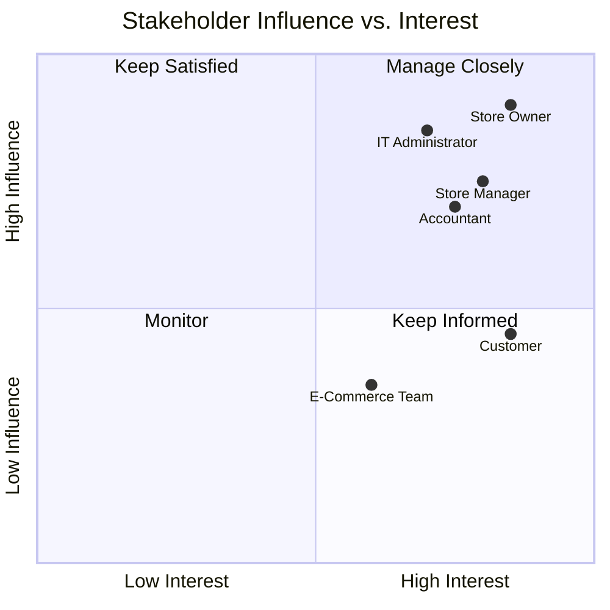

# 02. Stakeholder & User Role Analysis

## 2.1 Stakeholder 

| # | Stakeholder | Role | Interest | Influence | Key Concern |
| :---: | :--- | :--- | :--- | :---: | :---: |
| **1** | **Youssef Al-Ruqi** | Store Owner / Director | Strategic growth, ROI | High | Business profitability, inventory accuracy, and brand image |
| **2** | **Sarah Mansour** | Store Manager | Showroom & online operations | High | Ease of catalog updates, smooth order fulfillment, and workflow efficiency |
| **3** | **Ahmed Rayyan** | Accountant | Financial governance | High | Payment reconciliation, invoice accuracy, and tamper-resistant audit logs |
| **4** | **Deema Khaled** | Customer (End User) | Purchasing furniture | Medium | Intuitive checkout, persistent shopping carts, and clear order tracking |
| **5** | **Khaled Al-Najjar** | IT Administrator | System maintenance & security | High | Role-based access control (RBAC), database uptime, and system security |
| **6** | **E-Commerce Team** | Marketing & Content Editors | Product display | Medium | Clean visual layout, product categorization, and seamless UI/UX |

---

# 2.2 Stakeholder Map

This quadrant chart visualizes stakeholders based on their level of interest and influence over the **Ruqi Store** platform, helping prioritize their requirements during development.

---

# 2.3 Stakeholder Needs Summary

---

## 👤 Store Owner (Youssef Al-Ruqi)

### Needs:
- Real-time dashboards displaying sales trends.
- Reports about popular furniture products.
- Inventory turnover analytics.
- Business performance monitoring.

### Key Goal:
Transform traditional offline showroom operations into a fully digital business model that reduces inventory issues and increases revenue.

---

## 🪑 Store Manager (Sarah Mansour)

### Needs:
- A fast and intuitive management portal.
- Simple product catalog management.
- Ability to add:
  - Product dimensions.
  - Wood finishes.
  - Furniture specifications.
  - High-resolution WebP images.

### Key Goal:
Enable automatic real-time stock reduction after successful customer checkout to eliminate manual inventory tracking and prevent double-booking of products.

---
## 💳 Accountant (Ahmed Rayyan)

### Needs:
- Strict validation of payment workflows.
- Accurate invoice generation.
- Detailed financial transaction records.
- Immutable checkout price snapshots.

### Key Goal:
Ensure that future product price changes do not affect previous financial records by preserving accurate historical transaction data.

---

## 🛒 Customer (Deema Khaled)

### Needs:
- Premium responsive furniture browsing experience.
- Easy navigation through furniture collections.
- Persistent shopping cart that remains available after logout.
- A wishlist feature named **"Curated Collection"** for saving preferred designs.
- Clear order status tracking.

### Key Goal:
Provide a seamless and personalized shopping experience that helps customers discover, customize, and purchase furniture easily.

---

## 🔒 IT Administrator (Khaled Al-Najjar)

### Needs:
- Strict Role-Based Access Control (**RBAC**).
- Different permissions for:
  - Store Managers.
  - Accountants.
  - Content Editors.
  - Administrators.
- Complete security audit logs.
- Database transaction protection.
- Prevention of inventory conflicts during simultaneous purchases.

### Key Goal:
Maintain platform security, reliability, availability, and data integrity.

---

## 📢 E-Commerce Team

### Needs:
- Clean product presentation.
- Flexible content management.
- Organized furniture categories.
- Consistent premium UI/UX experience.
- Tools for marketing campaigns and product promotions.

### Key Goal:
Maintain an attractive online storefront that improves customer engagement and increases sales conversion.

---

# Stakeholder Priority Summary

| Stakeholder | Priority Level | Main Reason |
| :--- | :---: | :--- |
| Store Owner | Critical | Defines business objectives and success metrics |
| Store Manager | Critical | Controls daily operations and product management |
| IT Administrator | Critical | Responsible for security and system stability |
| Accountant | High | Ensures financial accuracy and compliance |
| Customer | High | Directly affects sales and platform success |
| E-Commerce Team | Medium | Improves product presentation and marketing effectiveness |

---

# Navigation
[← Previous: Use Case Model](./01-introduction.md) | [Back to Index](./00-index.md) | [Next:Requirements Specification →](./03-requirements.md)

