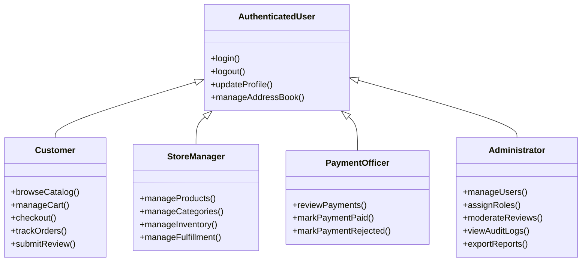
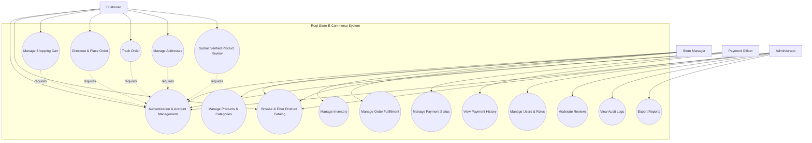

# 04. Use Case Model

## Ruqi Store — Use Case Model

---

## 4.1 Actor Catalog

| Actor | Type | Description | Key Goals |
|-------|------|-------------|-----------|
| **Customer** | Primary | Registered customer who browses furniture products and places online orders | Browse products, search and filter catalog, manage cart, place orders, track orders, manage addresses, submit verified reviews |
| **Store Manager** | Primary | Employee responsible for product catalog, inventory, and order fulfillment | Manage products, categories, inventory, and fulfillment status |
| **Payment Officer** | Primary | Employee responsible for reviewing and managing payment status | Review payments, mark payments as Paid or Rejected, record payment decisions |
| **Administrator** | Primary | System administrator responsible for system-wide user and security management | Manage users, assign/revoke roles, moderate reviews, view reports, and audit system actions |

---

## Actor Generalization



> **Note:** The generalization above represents common authenticated-user capabilities. Authorization is enforced through ASP.NET Core Identity roles and `[Authorize(Roles = "...")]`.

---

# 4.2 Use Case Diagram



---

# 4.3 Use Case Relationships

## Authentication Dependency

Customer-specific operations require an authenticated session.

The following use cases require the customer to be logged in:

- Manage Shopping Cart
- Checkout and Place Order
- Track Order
- Manage Addresses
- Submit Verified Product Review

ASP.NET Core Identity manages authentication using secure authentication cookies. Authorization is enforced through role-based policies.

---

## Role-Based Authorization

Each protected use case is restricted to the appropriate system role.

| Use Case | Required Role |
|----------|---------------|
| Browse Product Catalog | Anonymous / Authenticated |
| Manage Shopping Cart | Customer |
| Checkout & Place Order | Customer |
| Track Order | Customer |
| Manage Addresses | Customer |
| Submit Product Review | Customer |
| Manage Products & Categories | StoreManager |
| Manage Inventory | StoreManager |
| Manage Order Fulfillment | StoreManager |
| Manage Payment Status | PaymentOfficer |
| View Payment History | PaymentOfficer / Admin |
| Manage Users & Roles | Admin |
| Moderate Reviews | Admin |
| View Audit Logs | Admin |
| Export Reports | Admin |

---

# 4.4 Core Use Case List

| ID | Use Case | Primary Actor |
|----|----------|---------------|
| **UC-001** | Customer Registration | Customer / Guest |
| **UC-002** | Customer Login | Customer / Guest |
| **UC-003** | Browse & Filter Product Catalog | Customer / Guest |
| **UC-004** | View Product Details | Customer / Guest |
| **UC-005** | Manage Shopping Cart | Customer |
| **UC-006** | Checkout & Place Order | Customer |
| **UC-007** | Track Order | Customer |
| **UC-008** | Submit Verified Product Review | Customer |
| **UC-009** | Manage Addresses | Customer |
| **UC-010** | Manage Products & Categories | Store Manager |
| **UC-011** | Manage Inventory | Store Manager |
| **UC-012** | Update Order Fulfillment Status | Store Manager |
| **UC-013** | Manage Payment Status | Payment Officer |
| **UC-014** | Manage Users & Roles | Administrator |
| **UC-015** | Moderate Product Reviews | Administrator |
| **UC-016** | View Audit Logs & Reports | Administrator |

---

# 4.5 Fully Dressed Use Case — UC-006: Checkout & Place Order

| Field | Detail |
|-------|--------|
| **Use Case ID** | UC-006 |
| **Name** | Checkout & Place Order |
| **Primary Actor** | Customer |
| **Controller** | `OrdersController` |
| **Service** | `OrderService` |
| **Description** | A customer reviews their cart, selects or enters a delivery address, selects a supported payment method, and places an order. |
| **Preconditions** | Customer is authenticated; cart contains at least one item; products are active; sufficient stock is available. |
| **Postconditions** | Order is created; stock is deducted; order item prices and names are snapshotted; cart is cleared; order confirmation is displayed. |
| **Trigger** | Customer selects **"Proceed to Checkout"** and confirms the order. |

---

## Main Success Scenario

| Step | Action |
|------|--------|
| 1 | Customer opens the shopping cart. |
| 2 | Customer selects **"Proceed to Checkout."** |
| 3 | System displays saved delivery addresses. |
| 4 | Customer selects an existing address or enters a new address. |
| 5 | Customer selects a payment method: **Cash on Delivery** or **Bank Transfer**. |
| 6 | System displays the order summary, including items, shipping, tax, and total amount. |
| 7 | Customer confirms the order. |
| 8 | `OrderService.PlaceOrderAsync()` starts an EF Core database transaction. |
| 9 | System validates that all requested quantities are still available. |
| 10 | System creates the `Order` with `FulfillmentStatus = Pending` and `PaymentStatus = Unpaid`. |
| 11 | System creates `OrderItems` using the current product price as `UnitPrice` and the current product name as `ProductNameSnapshot`. |
| 12 | System deducts the purchased quantities from product inventory. |
| 13 | System clears the customer's cart items. |
| 14 | System commits the transaction. |
| 15 | System displays the order confirmation page with the generated `OrderId`. |

---

## Alternative Flows

| ID | Condition | Steps |
|----|-----------|-------|
| **A1** | Customer has no saved address | Customer enters a new delivery address. The system validates and uses it for the order. |
| **A2** | Customer changes cart quantity before checkout | System recalculates totals and validates the new quantity against current stock. |
| **A3** | Customer selects a different saved address | System uses the selected address and creates an immutable delivery address snapshot for the order. |

---

## Exception Flows

| ID | Condition | Steps |
|----|-----------|-------|
| **E1** | Empty cart | System rejects checkout and displays an `EmptyCartException` message. |
| **E2** | Insufficient stock | System rejects the order and displays an `InsufficientStockException` message. |
| **E3** | Product becomes unavailable | System prevents checkout for the inactive or unavailable product. |
| **E4** | Database transaction failure | System rolls back the transaction. Stock and cart data remain unchanged. |

---

## Business Rules

- Checkout must be executed inside an atomic EF Core transaction.
- Product stock cannot become negative.
- `OrderItem.UnitPrice` is a permanent price snapshot.
- `OrderItem.ProductNameSnapshot` is a permanent product-name snapshot.
- Historical order prices must never change when product prices are updated.
- Cart items are removed only after successful order creation.
- The order starts with `FulfillmentStatus = Pending`.
- The order starts with `PaymentStatus = Unpaid`.
- Supported payment methods are:
  - `CashOnDelivery`
  - `BankTransfer`

---

# 4.6 Fully Dressed Use Case — UC-012: Update Order Fulfillment Status

| Field | Detail |
|-------|--------|
| **Use Case ID** | UC-012 |
| **Name** | Update Order Fulfillment Status |
| **Primary Actor** | Store Manager |
| **Controller** | `StoreManagerController` |
| **Service** | `OrderService` |
| **Description** | Store Manager updates the fulfillment progress of a customer order. |
| **Preconditions** | Store Manager is authenticated and authorized; target order exists. |
| **Postconditions** | Valid fulfillment status transition is saved with an updated timestamp. |
| **Trigger** | Store Manager selects a new fulfillment status for an order. |

---

## Main Success Scenario

| Step | Action |
|------|--------|
| 1 | Store Manager opens `/Manager/Orders`. |
| 2 | System displays available orders. |
| 3 | Manager selects an order. |
| 4 | Manager selects a new fulfillment status. |
| 5 | `OrderService` validates the status transition. |
| 6 | System updates `FulfillmentStatus`. |
| 7 | System updates `UpdatedAt`. |
| 8 | System saves the changes through EF Core. |
| 9 | Customer sees the updated status on the next order-tracking request. |

---

## Valid Status Transitions

```text
Pending
   │
   ▼
Processing
   │
   ▼
Shipped
   │
   ▼
Delivered
```

Cancellation is allowed from any status except `Delivered`:

```text
Pending ────────┐
Processing ─────┤
Shipped ────────┤──> Cancelled
```

---

## Exception Flows

| ID | Condition | Result |
|----|-----------|--------|
| **E1** | Invalid transition | System rejects the request with `InvalidStatusTransitionException`. |
| **E2** | Order not found | System returns a not-found result. |
| **E3** | Unauthorized user | Access is denied by ASP.NET Core authorization. |

> **Important:** Store Manager can update `FulfillmentStatus` only. `PaymentStatus` is managed exclusively by the Payment Officer.

---

# 4.7 Fully Dressed Use Case — UC-013: Manage Payment Status

| Field | Detail |
|-------|--------|
| **Use Case ID** | UC-013 |
| **Name** | Manage Payment Status |
| **Primary Actor** | Payment Officer |
| **Controller** | `PaymentController` |
| **Service** | `PaymentService` |
| **Description** | Payment Officer reviews payment information and marks an order as Paid or Rejected. |
| **Preconditions** | Payment Officer is authenticated and authorized; target order exists. |
| **Postconditions** | Payment status is updated and an immutable `PaymentLog` record is created. |
| **Trigger** | Payment Officer selects an unpaid order for payment processing. |

---

## Main Success Scenario — Mark Paid

| Step | Action |
|------|--------|
| 1 | Payment Officer opens the payment dashboard. |
| 2 | System displays orders requiring payment review. |
| 3 | Payment Officer selects an order. |
| 4 | Payment Officer selects **Mark Paid**. |
| 5 | `PaymentService` validates the current payment status. |
| 6 | System changes `PaymentStatus` from `Unpaid` to `Paid`. |
| 7 | System creates a `PaymentLog` containing the previous and new status. |
| 8 | System saves the changes. |
| 9 | Payment history reflects the new payment decision. |

---

## Alternative Flow — Reject Payment

| Step | Action |
|------|--------|
| 1 | Payment Officer selects **Reject**. |
| 2 | System displays a rejection-reason field. |
| 3 | Payment Officer enters the reason. |
| 4 | `PaymentService` validates that the reason is not empty. |
| 5 | System changes `PaymentStatus` to `Rejected`. |
| 6 | System stores the rejection reason. |
| 7 | System creates an immutable `PaymentLog`. |

---

## Business Rules

- Only `PaymentOfficer` can change payment status.
- `PaymentStatus` values are:
  - `Unpaid`
  - `Paid`
  - `Rejected`
- A rejection requires a non-empty rejection reason.
- Every payment decision creates a `PaymentLog`.
- `PaymentLog` is append-only.
- Payment logs cannot be updated or deleted.

---

# 4.8 Fully Dressed Use Case — UC-008: Submit Verified Product Review

| Field | Detail |
|-------|--------|
| **Use Case ID** | UC-008 |
| **Name** | Submit Verified Product Review |
| **Primary Actor** | Customer |
| **Controller** | `ProductsController` |
| **Service** | `ReviewService` |
| **Description** | A customer submits a review for a product they previously purchased and received. |
| **Preconditions** | Customer is authenticated; customer has a Delivered order containing the product; customer has not already reviewed the product. |
| **Postconditions** | Review is stored with `IsVerifiedPurchase = true` and becomes visible according to the system moderation state. |
| **Trigger** | Customer selects the review option for an eligible purchased product. |

---

## Main Flow

| Step | Action |
|------|--------|
| 1 | Customer opens the product details page. |
| 2 | System checks whether the customer has a Delivered order containing the product. |
| 3 | System checks whether the customer has already reviewed the product. |
| 4 | Customer enters a rating from 1 to 5 stars. |
| 5 | Customer optionally enters a title and comment. |
| 6 | Customer submits the review. |
| 7 | `ReviewService` validates the review rules. |
| 8 | System saves the review with `IsVerifiedPurchase = true`. |
| 9 | System recalculates the product's average rating. |

---

## Exception Flows

| ID | Condition | Result |
|----|-----------|--------|
| **E1** | No Delivered purchase | System rejects the review with `NoPurchaseFoundException`. |
| **E2** | Customer already reviewed product | System rejects the review with `DuplicateReviewException`. |
| **E3** | Invalid rating | System rejects the submitted rating. |

---

## Business Rules

- Only authenticated customers can submit reviews.
- A review requires a Delivered order containing the reviewed product.
- Each customer can submit only one review per product.
- Rating must be between 1 and 5.
- Verified purchases are marked using `IsVerifiedPurchase = true`.
- Review visibility is controlled through `IsVisible`.
- Administrators can moderate reviews.

---

# 4.9 Customer Data Isolation

Customer-specific use cases must enforce data isolation through the Service Layer.

A customer may access only their own:

- Cart
- Cart items
- Orders
- Order items
- Addresses
- Reviews

The Service Layer validates:

```text
entity.UserId == currentUserId
```

If the requested resource belongs to another customer, the system denies access.

This rule applies to:

- Order details
- Order history
- Cart operations
- Address management
- Customer-specific review operations

---

# 4.10 Administrator Use Cases

The Administrator has system-wide oversight and management capabilities.

### User Management

The Administrator can:

- View users
- Search users
- Activate users
- Deactivate users
- Assign roles
- Revoke roles

The Administrator cannot modify their own permissions or deactivate their own account.

---

### Review Moderation

The Administrator can:

- View reviews
- Filter reviews
- Hide reviews by setting `IsVisible = false`

Every review moderation action creates an `AuditLog`.

---

### Audit Logs

The Administrator can view immutable audit records containing:

- Timestamp
- Actor
- Action type
- Target entity
- Target entity ID
- Description

Audit logs are append-only.

---

### Reports

The Administrator can export CSV reports including:

- Revenue by period
- Orders by fulfillment status
- Orders by payment status
- Top products
- Top customers
- Inventory summary

---

# 4.11 Features Outside the Current Use Case Scope

The following features are **not part of the current implemented use case model**:

| Feature | Status |
|---------|--------|
| Showroom / Appointment Booking | Removed from project scope |
| Accountant Role | Replaced by Payment Officer |
| Wishlist | Future Feature |
| External Payment Gateway | Not integrated |
| Transactional Email Service | Not part of current implementation |
| Native Mobile Application | Not implemented |
| Multi-vendor Marketplace | Not implemented |

The Wishlist may be introduced in a future version, but it is not a current system use case.

---

# 4.12 Use Case to System Component Mapping

| Use Case | Controller | Service Layer | Main Data |
|----------|------------|---------------|-----------|
| Customer Registration | `AccountController` | ASP.NET Core Identity | `AspNetUsers` |
| Customer Login | `AccountController` | `SignInManager` | `AspNetUsers` |
| Browse Catalog | `ProductsController` | `ProductService` | `Products`, `Categories` |
| View Product | `ProductsController` | `ProductService` | `Products`, `ProductImages`, `Reviews` |
| Manage Cart | `CartController` | `CartService` | `Carts`, `CartItems` |
| Checkout | `OrdersController` | `OrderService` | `Orders`, `OrderItems`, `Products`, `CartItems` |
| Track Order | `OrdersController` | `OrderService` | `Orders`, `OrderItems` |
| Manage Addresses | `AccountController` | `AddressService` | `Addresses` |
| Submit Review | `ProductsController` | `ReviewService` | `Reviews`, `Orders`, `OrderItems` |
| Manage Products | `StoreManagerController` | `ProductService` | `Products`, `ProductImages` |
| Manage Inventory | `StoreManagerController` | `InventoryService` | `Products` |
| Update Fulfillment | `StoreManagerController` | `OrderService` | `Orders` |
| Manage Payment | `PaymentController` | `PaymentService` | `Orders`, `PaymentLogs` |
| Manage Users | `AdminController` | `AdminService` | `AspNetUsers`, Identity Roles |
| Moderate Reviews | `AdminController` | `AdminService` | `Reviews`, `AuditLogs` |
| View Audit Logs | `AdminController` | `AdminService` | `AuditLogs` |
| Export Reports | `AdminController` | `ReportService` | Orders, Products, Users |

---

## Summary

The Ruqi Store use case model represents a **single-vendor furniture e-commerce system** implemented using a **monolithic ASP.NET Core MVC architecture**.

The four primary system roles are:

1. **Customer**
2. **Store Manager**
3. **Payment Officer**
4. **Administrator**

Authentication and authorization are handled through **ASP.NET Core Identity**, while business rules are enforced in the Service Layer and persisted through **Entity Framework Core**.

The current scope focuses on:

- Product catalog browsing
- Shopping cart
- Checkout and order placement
- Order tracking
- Payment management
- Product reviews
- Inventory management
- Store management
- User and role management
- Audit logging
- Administrative reporting

Showroom appointments and the Accountant role are not part of the current Ruqi Store scope.

---

[← Previous: Requirements Specification](./03-requirements.md) | [Back to Index](./00-index.md) | [Next: Customer Features →](./05-customer-features.md)
