# 04. Use Case Model

## Ruqi Store — Use Case Model

---

## 4.1 Actor Catalog

| Actor | Type | Description | Key Goals |
|-------|------|-------------|-----------|
| **Customer** | Primary | Registered customer who browses furniture products and places online orders | Browse products, search and filter catalog, manage cart, place orders, track orders, manage addresses, submit verified reviews |
| **Guest** | Primary | Unauthenticated visitor who can browse the public product catalog and access authentication pages | Browse products, search and filter catalog, view product details, register, log in |
| **Store Manager** | Primary | Employee responsible for product catalog, inventory, and order fulfillment | Manage products, categories, inventory, and fulfillment status |
| **Payment Officer** | Primary | Employee responsible for reviewing and managing payment status | Review payments, mark payments as Paid or Rejected, record payment decisions |
| **Administrator** | Primary | System administrator responsible for system-wide user and security management | Manage users, assign/revoke roles, moderate reviews, view reports, view payment history, and audit system actions |

---

## Authentication and Common User Capabilities

All official system roles are authenticated through **ASP.NET Core Identity**.

Common authentication and account capabilities such as registration, login, logout, profile management, and account security are provided through the shared Identity infrastructure.

Role-specific authorization is enforced through ASP.NET Core Identity roles and `[Authorize(Roles = "...")]`.

> **Note:** The system has four official authenticated roles: Customer, Store Manager, Payment Officer, and Administrator. Guest is an unauthenticated visitor who can access public catalog functionality and authentication-related operations. Common authentication capabilities are shared infrastructure and are not represented as a separate system actor.

---

# 4.2 Use Case Diagram

```mermaid
graph TB

    subgraph RuqiStore["Ruqi Store E-Commerce System"]

        UC1((Customer Registration))
        UC2((Customer Login))
        UC3((Browse & Filter Product Catalog))
        UC4((View Product Details))
        UC5((Manage Shopping Cart))
        UC6((Checkout & Place Order))
        UC7((Track Order))
        UC8((Submit Verified Product Review))
        UC9((Manage Addresses))

        UC10((Manage Products & Categories))
        UC11((Manage Inventory))
        UC12((Update Order Fulfillment Status))

        UC13((Manage Payment Status))
        UC14((View Payment History))

        UC15((Manage Users & Roles))
        UC16((Moderate Product Reviews))
        UC17((View Audit Logs))
        UC18((Export Reports))

    end

    Customer[Customer]
    Guest[Guest]
    Manager[Store Manager]
    Payment[Payment Officer]
    Admin[Administrator]

    Guest --> UC1
    Guest --> UC2
    Guest --> UC3
    Guest --> UC4

    Customer --> UC1
    Customer --> UC2
    Customer --> UC3
    Customer --> UC4
    Customer --> UC5
    Customer --> UC6
    Customer --> UC7
    Customer --> UC8
    Customer --> UC9

    Manager --> UC2
    Manager --> UC10
    Manager --> UC11
    Manager --> UC12

    Payment --> UC2
    Payment --> UC13
    Payment --> UC14

    Admin --> UC2
    Admin --> UC13
    Admin --> UC14
    Admin --> UC15
    Admin --> UC16
    Admin --> UC17
    Admin --> UC18

    UC5 -.->|requires authentication| UC2
    UC6 -.->|requires authentication| UC2
    UC7 -.->|requires authentication| UC2
    UC8 -.->|requires authentication| UC2
    UC9 -.->|requires authentication| UC2

```

---

# 4.3 Use Case Relationships

## Authentication Dependency

Customer-specific operations require an authenticated session.

The following use cases require the customer to be logged in:

* Manage Shopping Cart
* Checkout and Place Order
* Track Order
* Manage Addresses
* Submit Verified Product Review

ASP.NET Core Identity manages authentication using secure authentication cookies. Authorization is enforced through role-based policies.

---

## Role-Based Authorization

Each protected use case is restricted to the appropriate system role.

| Use Case | Required Role |
| --- | --- |
| Customer Registration | Guest / Customer |
| Customer Login | Guest / Customer / Store Manager / Payment Officer / Administrator |
| Browse Product Catalog | Guest / Authenticated |
| View Product Details | Guest / Authenticated |
| Manage Shopping Cart | Customer |
| Checkout & Place Order | Customer |
| Track Order | Customer |
| Manage Addresses | Customer |
| Submit Verified Product Review | Customer |
| Manage Products & Categories | Store Manager |
| Manage Inventory | Store Manager |
| Update Order Fulfillment Status | Store Manager |
| Manage Payment Status | Payment Officer |
| View Payment History | Payment Officer / Administrator |
| Manage Users & Roles | Administrator |
| Moderate Product Reviews | Administrator |
| View Audit Logs | Administrator |
| Export Reports | Administrator |

---

# 4.4 Core Use Case List

| ID | Use Case | Primary Actor |
| --- | --- | --- |
| **UC-001** | Customer Registration | Customer / Guest |
| **UC-002** | Customer Login | Customer / Guest |
| **UC-003** | Browse & Filter Product Catalog | Customer / Guest |
| **UC-004** | View Product Details | Customer / Guest |
| **UC-005** | Manage Shopping Cart | Customer |
| **UC-006** | Checkout & Place Order | Customer |
| **UC-007** | Track Order | Customer |
| **UC-008** | Submit Verified Product Review | Customer |
| **UC-009** | Manage Addresses | Customer |
| **UC-010** | Manage Products & Categories | Store Manager |
| **UC-011** | Manage Inventory | Store Manager |
| **UC-012** | Update Order Fulfillment Status | Store Manager |
| **UC-013** | Manage Payment Status | Payment Officer |
| **UC-014** | Manage Users & Roles | Administrator |
| **UC-015** | Moderate Product Reviews | Administrator |
| **UC-016** | Export Reports | Administrator |
| **UC-017** | View Audit Logs | Administrator |
| **UC-018** | View Payment History | Payment Officer / Administrator |

> **Note:** Authentication is represented through the Customer Registration and Customer Login use cases and is implemented using ASP.NET Core Identity.

---
