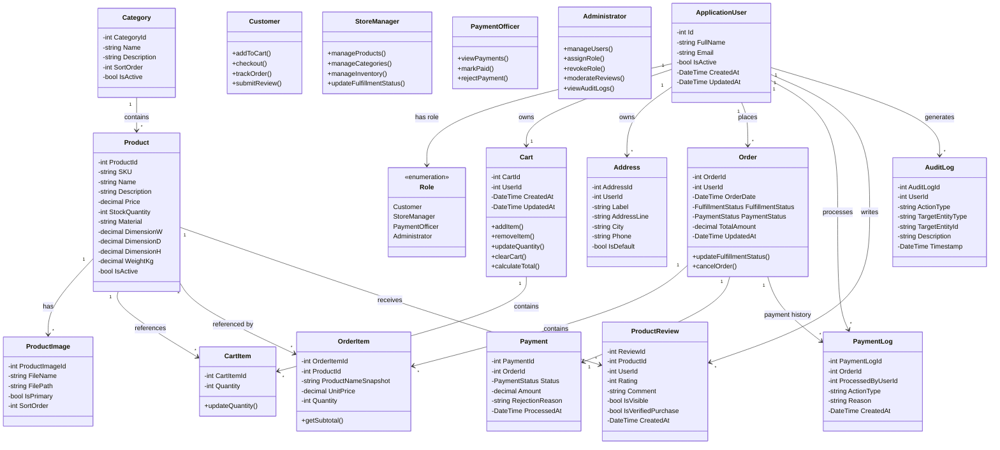
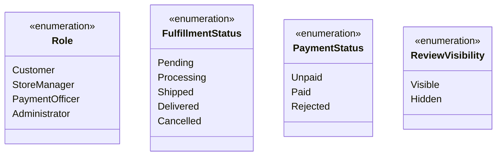

# 06. Domain Model & Class Diagram

## 6.1 Identifying Classes from Use Cases

Domain classes are identified by examining the system's use cases, functional requirements, business rules, and persistent data structures. The analysis focuses on the main entities involved in customer accounts, product catalog management, shopping carts, orders, payments, reviews, addresses, and administration.

| Source | Nouns Extracted | Candidate Class |
| :--- | :--- | :--- |
| **UC-005: Manage Shopping Cart** | customer, cart, cart item, product | Customer, Cart, CartItem, Product |
| **UC-006: Checkout & Place Order** | customer, cart, order, order item, product, address, payment | Customer, Cart, Order, OrderItem, Product, Address, Payment |
| **UC-007: Track Order** | customer, order, fulfillment status, payment status, order item | Customer, Order, OrderItem |
| **UC-008: Submit Verified Product Review** | customer, product, review, rating, comment, purchase | Customer, Product, ProductReview |
| **UC-010: Manage Products & Categories** | product, category, SKU, image | Product, Category, ProductImage |
| **UC-011: Manage Inventory** | product, stock, category | Product, Category |
| **UC-012: Update Order Fulfillment Status** | order, fulfillment status, manager | Order, StoreManager |
| **UC-013: Manage Payment Status** | payment, payment status, payment log, rejection reason | Payment, PaymentLog |
| **UC-014: Manage Users & Roles** | user, role, account status, administrator | ApplicationUser, Role, Administrator |
| **UC-015: Moderate Product Reviews** | review, administrator, audit log | ProductReview, Administrator, AuditLog |
| **UC-017: View Audit Logs** | audit log, administrator | AuditLog, Administrator |
| **UC-018: View Payment History** | payment, payment log, administrator, payment officer | Payment, PaymentLog, Administrator, PaymentOfficer |

After removing transient request objects, UI-specific elements, and out-of-scope features, the final structural domain classes are defined below.

---

## 6.2 Domain Model

## 6.3 Class Relationship Summary

| Relationship | Type | Description |
| :--- | :--- | :--- |
| **ApplicationUser → Role** | Association | Each authenticated user has one or more system roles managed through ASP.NET Core Identity. |
| **Category → Product** | Association (1:*) | A category contains multiple furniture products. |
| **Product → ProductImage** | Composition (1:*) | A product may contain multiple uploaded images, with one image optionally marked as primary. |
| **ApplicationUser → Cart** | Composition (1:1) | Each customer has one persistent shopping cart. |
| **Cart → CartItem** | Composition (1:*) | Cart items belong exclusively to their cart. |
| **Product → CartItem** | Association (1:*) | A product can be referenced by multiple cart items belonging to different customers. |
| **ApplicationUser → Address** | Composition (1:*) | A customer may maintain multiple saved shipping addresses. |
| **ApplicationUser → Order** | Association (1:*) | A customer may place multiple orders. |
| **Order → OrderItem** | Composition (1:*) | Each order contains one or more immutable purchase line items. |
| **Product → OrderItem** | Association (1:*) | Order items reference products while preserving historical product and price snapshots. |
| **Order → Payment** | Association (1:1) | Each order has an associated payment record. |
| **Order → PaymentLog** | Association (1:*) | Payment actions for an order are recorded as append-only payment log entries. |
| **ApplicationUser → PaymentLog** | Association (1:*) | Payment officers generate payment log entries when processing payments. |
| **ApplicationUser → ProductReview** | Association (1:*) | A customer may submit reviews for eligible purchased products. |
| **Product → ProductReview** | Association (1:*) | A product may receive multiple customer reviews. |
| **ApplicationUser → AuditLog** | Association (1:*) | Administrative and other audited system actions are recorded against the responsible user. |

---

## 6.4 Enumeration Types

### Enumeration Descriptions

| Enumeration | Values | Purpose |
| :--- | :--- | :--- |
| **Role** | Customer, StoreManager, PaymentOfficer, Admin | Defines role-based permissions within the system. |
| **FulfillmentStatus** | Pending, Processing, Shipped, Delivered, Cancelled | Represents the lifecycle of an order from placement to fulfillment. |
| **PaymentStatus** | Unpaid, Paid, Rejected | Represents the current payment state of an order. |
| **ReviewVisibility** | Visible, Hidden | Controls whether a customer review is displayed publicly after moderation. |

---

## 6.5 Important Domain Constraints

The domain model follows the business rules defined for Ruqi Store:

- `OrderItem.UnitPrice` is an immutable price snapshot captured when the order is created.
- `OrderItem.ProductNameSnapshot` preserves the product name at the time of purchase.
- Products are soft-deleted by setting `IsActive = false`; historical order records remain intact.
- `StockQuantity` cannot become negative.
- Each customer has one persistent shopping cart.
- A customer can submit only one review per product.
- Reviews are permitted only when the customer has a delivered order containing the product.
- Payment logs are append-only.
- Audit logs are append-only.
- Customer-owned records must be isolated so customers can access only their own data.
- A customer may have a maximum of five saved addresses.
- Order fulfillment status changes must follow the valid status transition rules.
- Payment status is managed exclusively by the Payment Officer.
- Store Managers manage fulfillment status but cannot modify payment status.

---

[← Previous: User Stories](./05-user-stories.md) | [Back to Index](./00-index.md) | [Next: UML Behavioral Models →](./07-uml-behavioral.md)
