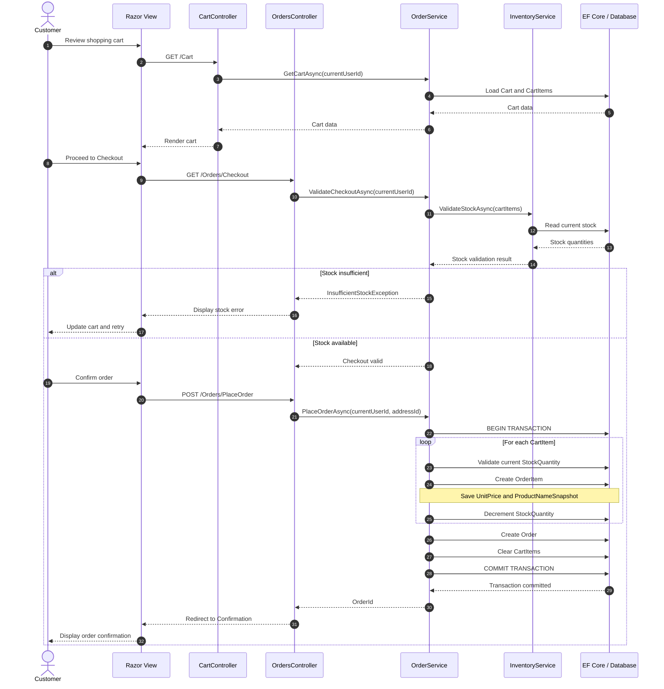
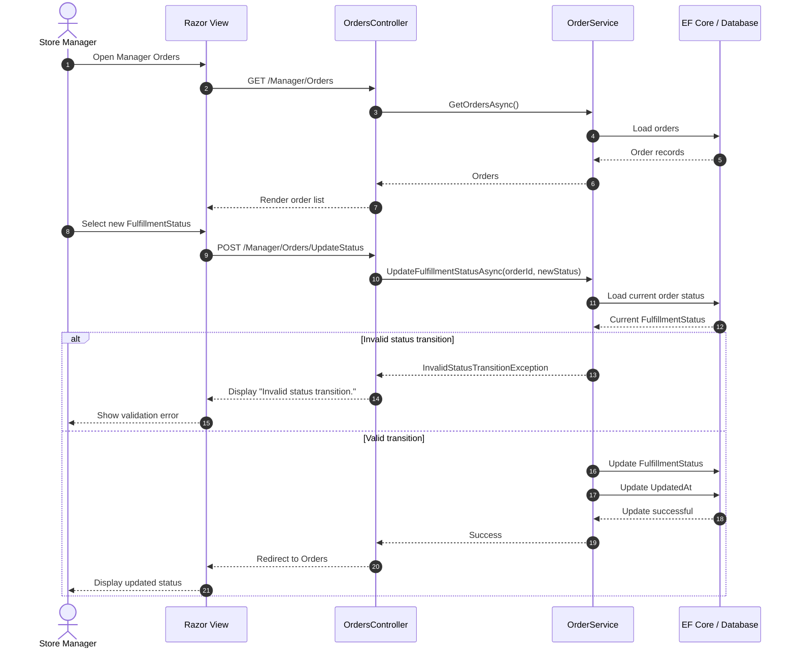
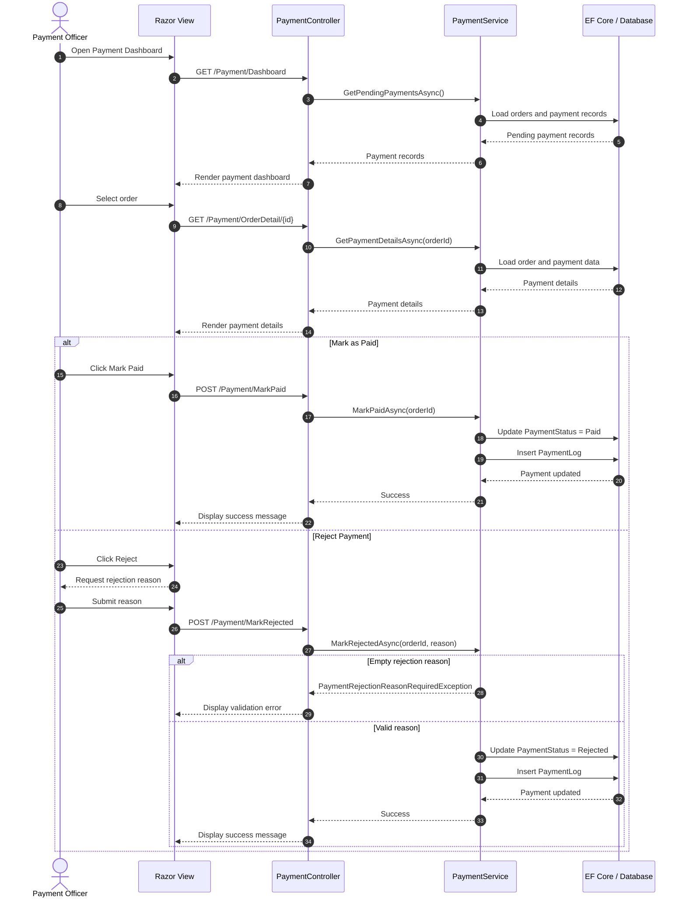
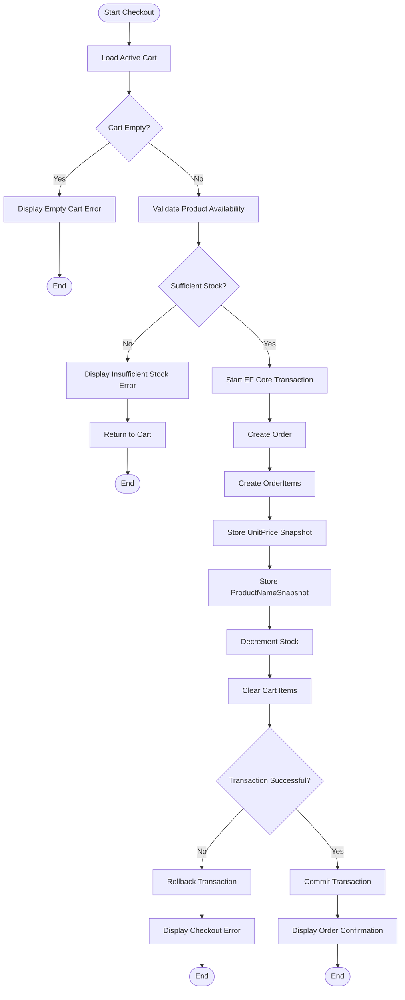
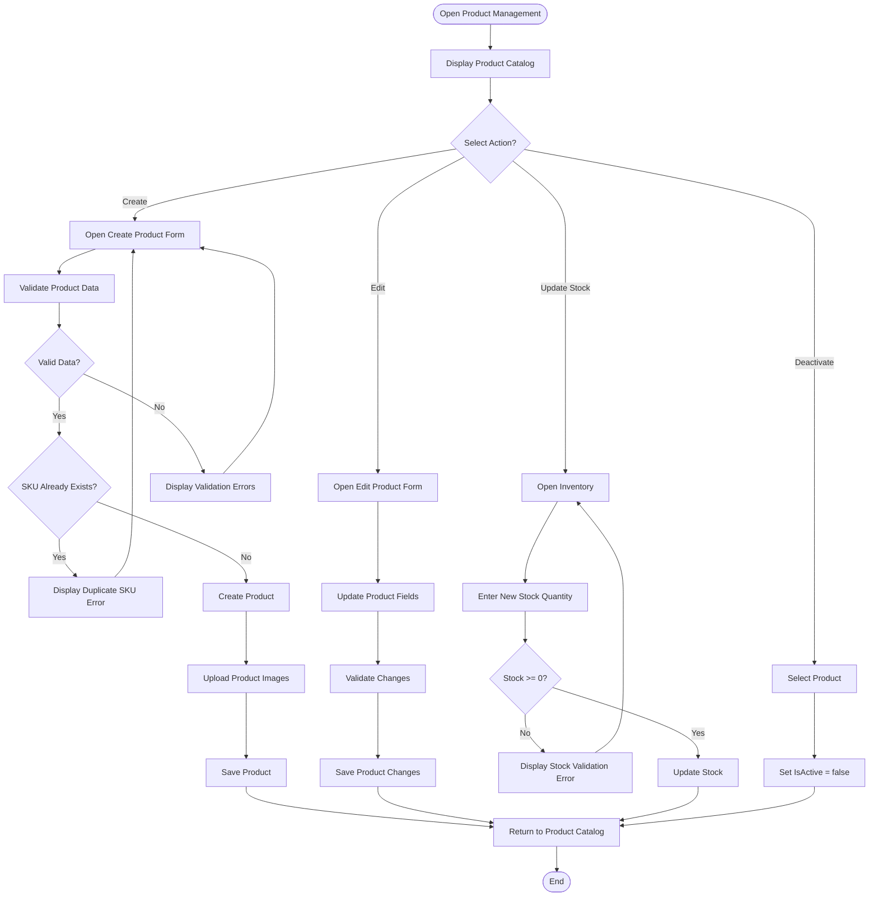
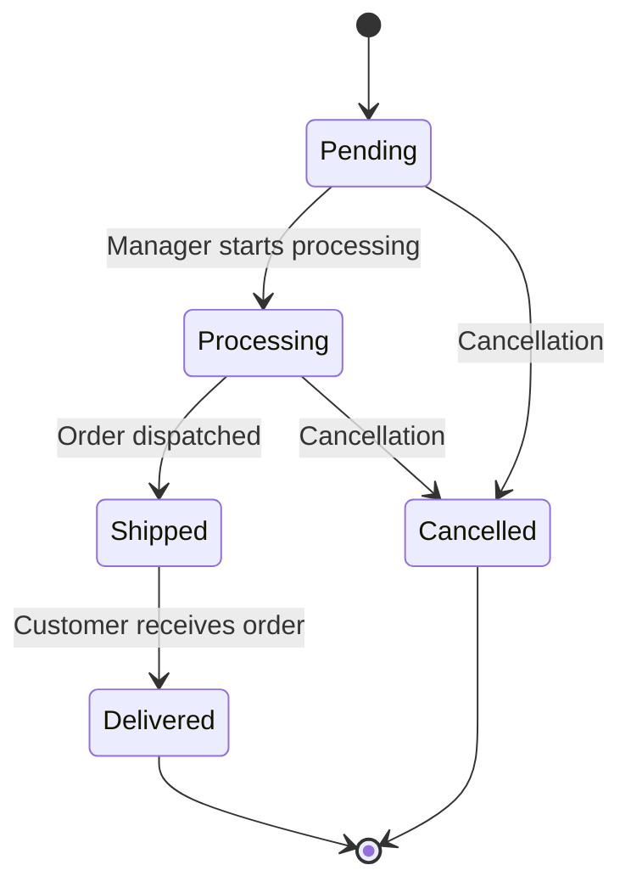
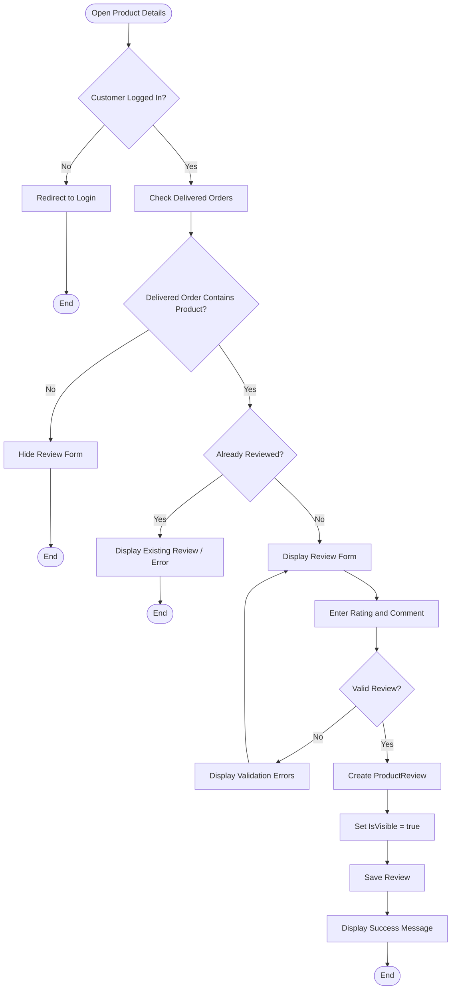
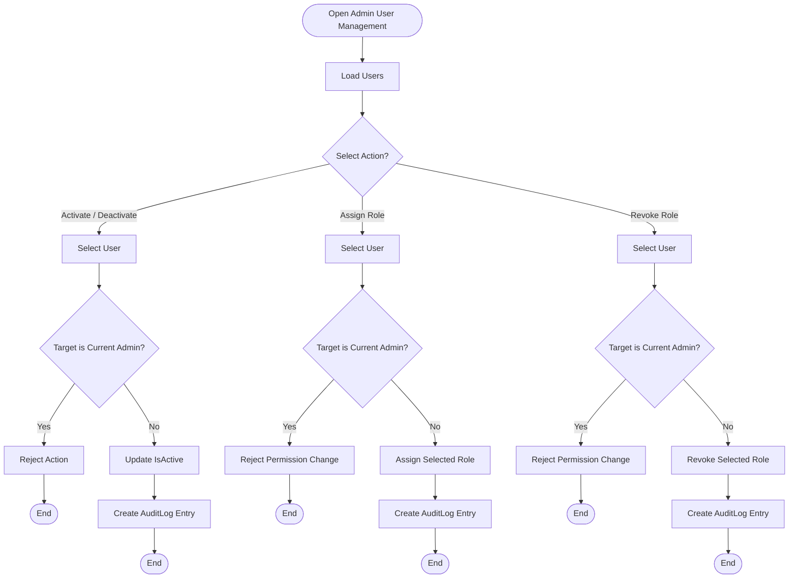

# 07. UML Behavioral Models

## Ruqi Store — Behavioral System Models

---

## 7.1 Sequence Diagram: Checkout & Place Order

This diagram illustrates the interaction between the customer, MVC controllers, service layer, repository/data access layer, and database during the checkout process.

The checkout operation is executed as an atomic transaction to ensure stock consistency, immutable price snapshots, order creation, and cart clearance.

### Behavioral Notes

- Checkout is handled through **ASP.NET Core MVC controllers and the Service Layer**.
- Business rules are enforced inside the Service Layer.
- EF Core manages database operations and transactions.
- `OrderItem.UnitPrice` is captured as an immutable price snapshot.
- `OrderItem.ProductNameSnapshot` preserves the product name at the time of purchase.
- Stock cannot become negative.
- The shopping cart is cleared only after successful order creation.
- If any transaction operation fails, the transaction is rolled back.

---

## 7.2 Sequence Diagram: Store Manager Updates Fulfillment Status

This diagram illustrates how a Store Manager updates an order's fulfillment status while payment status remains controlled exclusively by the Payment Officer.

### Fulfillment Status Rules

| Current Status | Allowed Next Status |
| :--- | :--- |
| **Pending** | Processing, Cancelled |
| **Processing** | Shipped, Cancelled |
| **Shipped** | Delivered |
| **Delivered** | None |
| **Cancelled** | None |

> **Important:** Store Managers can update `FulfillmentStatus` only. `PaymentStatus` is managed exclusively by the Payment Officer.

---

## 7.3 Sequence Diagram: Payment Officer Processes Payment

This diagram illustrates the payment processing workflow performed by the Payment Officer.

### Payment Processing Rules

- Only users with the `PaymentOfficer` role can process payments.
- `PaymentStatus` can be changed by the Payment Officer only.
- A rejected payment requires a non-empty rejection reason.
- Every payment action creates a `PaymentLog`.
- `PaymentLog` is append-only and cannot be updated or deleted.

---

## 7.4 Activity Diagram: Order Processing & Checkout

This activity diagram describes the complete customer checkout workflow.

### Checkout Rules

| Rule | Description |
| :--- | :--- |
| **Atomic Transaction** | Order creation, stock deduction, and cart clearance are committed as one transaction. |
| **Stock Validation** | Stock is validated before and during order creation. |
| **Price Snapshot** | Current product price is stored in `OrderItem.UnitPrice`. |
| **Product Snapshot** | Product name is stored in `OrderItem.ProductNameSnapshot`. |
| **Cart Clearance** | Cart items are removed after successful order creation. |
| **Rollback** | Any failure causes the transaction to roll back. |

---

## 7.5 Activity Diagram: Product Management

This activity diagram describes the Store Manager workflow for creating and maintaining furniture products.

### Product Management Rules

- Only the Store Manager can manage products and inventory.
- SKU values must be unique.
- Product price must be greater than zero.
- Stock quantity cannot be negative.
- A maximum of 8 product images can be uploaded.
- Accepted image formats are JPEG, PNG, and WebP.
- Each image must be under 5 MB.
- Uploaded filenames are generated by the server using GUIDs.
- Products are soft-deleted by setting `IsActive = false`.
- Historical orders and order items remain intact after product deactivation.

---

## 7.6 State Machine Diagram: Order Fulfillment Lifecycle

The following state machine represents the valid fulfillment lifecycle of an order.

### State Descriptions & Rules

| State | Description | Allowed Transitions |
| :--- | :--- | :--- |
| **Pending** | Order has been created and is awaiting processing. | Processing, Cancelled |
| **Processing** | Store Manager is preparing the order for shipment. | Shipped, Cancelled |
| **Shipped** | Order has been dispatched for delivery. | Delivered |
| **Delivered** | Customer has received the order. | None |
| **Cancelled** | Order has been cancelled and cannot continue through fulfillment. | None |

> Payment status is intentionally separated from fulfillment status. Payment processing is handled by the Payment Officer.

---

## 7.7 Activity Diagram: Product Review Submission

This activity diagram describes how a customer submits a verified product review.

### Review Rules

- Only authenticated customers can submit reviews.
- A review is allowed only when the customer has a delivered order containing the product.
- Each customer can submit only one review per product.
- Review rating must be within the configured 1–5 range.
- Review records are associated with both the customer and product.
- Review moderation is handled by the Administrator.

---

## 7.8 Activity Diagram: Administrator User Management

This activity diagram illustrates how an Administrator manages customer and staff accounts.

### Administrator Rules

- All Admin pages are protected by `[Authorize(Roles = "Admin")]`.
- Administrators cannot deactivate their own account.
- Administrators cannot modify their own permissions.
- User deactivation is soft deactivation; user data is preserved.
- Role changes are recorded in `AuditLog`.
- Account activation/deactivation is recorded in `AuditLog`.
- Audit logs are append-only.
- No Admin action can update or delete existing audit log records.

---

## 7.9 Behavioral Model Summary

| Behavioral Model | Main Purpose |
| :--- | :--- |
| **Checkout Sequence** | Shows the interaction between customer, MVC controllers, services, EF Core, and database during order placement. |
| **Fulfillment Sequence** | Shows how Store Managers update order fulfillment status. |
| **Payment Sequence** | Shows how Payment Officers process and log payment actions. |
| **Checkout Activity** | Represents the complete checkout decision flow and transaction handling. |
| **Product Management Activity** | Represents product creation, editing, inventory updates, and soft deletion. |
| **Order State Machine** | Defines valid fulfillment status transitions. |
| **Review Activity** | Represents verified purchase review submission and validation. |
| **Admin Activity** | Represents user activation, deactivation, role assignment, and role revocation. |

---

[← Previous: Domain Model](./06-domain-model.md) | [Back to Index](./00-index.md) | [Next: Database Design →](./08-database-design.md)
