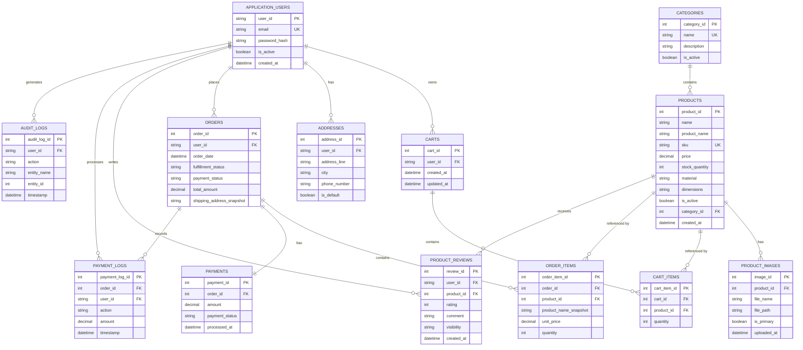

# 08. Database Design

## 8.1 Entity-Relationship Diagram (ERD)

This diagram defines the relational database model for **Ruqi Store**, representing user accounts, product catalog, persistent shopping carts, customer addresses, order processing, payment records, reviews, and system audit logs.


## 8.2 Normalized Schema (3NF)

The relational database schema of **Ruqi Store** is designed according to **Third Normal Form (3NF)** principles to minimize data redundancy, maintain referential integrity, and prevent insertion, update, and deletion anomalies.

---

## Core Identity & Role Management

### application_users

| Column | Type | Constraints | Notes |
| :--- | :--- | :--- | :--- |
| user_id | VARCHAR(450) | PK | ASP.NET Core Identity user identifier |
| email | VARCHAR(256) | NOT NULL, UNIQUE | Primary login credential |
| password_hash | VARCHAR(MAX) | NOT NULL | Password hash managed by ASP.NET Core Identity |
| is_active | BOOLEAN | NOT NULL, DEFAULT TRUE | Controls whether the account is active |
| created_at | DATETIME2 | NOT NULL | Account creation timestamp |

### Identity Roles

Roles are managed through **ASP.NET Core Identity** rather than a custom role column in the application user table.

The defined system roles are:

- `Customer`
- `Store Manager`
- `Payment Officer`
- `Administrator`

Role assignments determine authorization for protected controllers, actions, and administrative functions.

---

## Catalog & Inventory Tables

### categories

| Column | Type | Constraints | Notes |
| :--- | :--- | :--- | :--- |
| category_id | INT | PK, AUTO_INCREMENT | Unique category identifier |
| name | VARCHAR(100) | NOT NULL, UNIQUE | Furniture category name |
| description | NVARCHAR(500) | NULL | Category description |
| is_active | BOOLEAN | NOT NULL, DEFAULT TRUE | Controls category visibility |

### products

| Column | Type | Constraints | Notes |
| :--- | :--- | :--- | :--- |
| product_id | INT | PK, AUTO_INCREMENT | Unique product identifier |
| name | NVARCHAR(200) | NOT NULL | Public product name |
| sku | VARCHAR(50) | NOT NULL, UNIQUE | Stock Keeping Unit |
| description | NVARCHAR(MAX) | NULL | Detailed product description |
| price | DECIMAL(18,2) | NOT NULL, CHECK (price >= 0) | Current selling price |
| stock_quantity | INT | NOT NULL, CHECK (stock_quantity >= 0) | Available physical stock |
| material | NVARCHAR(150) | NULL | Product material |
| dimensions | NVARCHAR(200) | NULL | Product dimensions |
| is_active | BOOLEAN | NOT NULL, DEFAULT TRUE | Soft-delete / visibility flag |
| category_id | INT | FK → categories | Product category |
| created_at | DATETIME2 | NOT NULL | Product creation timestamp |

### product_images

| Column | Type | Constraints | Notes |
| :--- | :--- | :--- | :--- |
| image_id | INT | PK, AUTO_INCREMENT | Unique image identifier |
| product_id | INT | FK → products | Associated furniture product |
| file_name | NVARCHAR(255) | NOT NULL | Uploaded image file name |
| file_path | NVARCHAR(500) | NOT NULL | Server-side upload path |
| is_primary | BOOLEAN | NOT NULL, DEFAULT FALSE | Indicates the primary product image |
| uploaded_at | DATETIME2 | NOT NULL | Upload timestamp |

Product images are stored through the application's file-upload mechanism and associated with their corresponding product records.

---

## Customer Data

### addresses

| Column | Type | Constraints | Notes |
| :--- | :--- | :--- | :--- |
| address_id | INT | PK, AUTO_INCREMENT | Unique address identifier |
| user_id | VARCHAR(450) | FK → application_users | Address owner |
| address_line | NVARCHAR(500) | NOT NULL | Saved shipping address |
| city | NVARCHAR(100) | NOT NULL | Customer city |
| phone_number | VARCHAR(20) | NULL | Contact phone number |
| is_default | BOOLEAN | NOT NULL, DEFAULT FALSE | Default shipping address |

Each customer may maintain multiple saved addresses, subject to the system limit of **five addresses per customer**.

---

## Carts

### carts

| Column | Type | Constraints | Notes |
| :--- | :--- | :--- | :--- |
| cart_id | INT | PK, AUTO_INCREMENT | Unique shopping cart identifier |
| user_id | VARCHAR(450) | FK → application_users, UNIQUE | Customer who owns the cart |
| created_at | DATETIME2 | NOT NULL | Cart creation timestamp |
| updated_at | DATETIME2 | NOT NULL | Last cart modification timestamp |

Each customer has exactly **one persistent shopping cart**.

### cart_items

| Column | Type | Constraints | Notes |
| :--- | :--- | :--- | :--- |
| cart_item_id | INT | PK, AUTO_INCREMENT | Unique cart item identifier |
| cart_id | INT | FK → carts, ON DELETE CASCADE | Parent shopping cart |
| product_id | INT | FK → products | Selected product |
| quantity | INT | NOT NULL, CHECK (quantity > 0) | Requested quantity |

**Unique Constraint**

```text
UNIQUE(cart_id, product_id)

```
This constraint prevents duplicate entries for the same product in a customer's cart.

---

## Checkout & Ordering Tables

### orders

| Column | Type | Constraints | Notes |
| :--- | :--- | :--- | :--- |
| order_id | INT | PK, AUTO_INCREMENT | Unique order identifier |
| user_id | VARCHAR(450) | FK → application_users | Customer who placed the order |
| order_date | DATETIME2 | NOT NULL | Order creation timestamp |
| fulfillment_status | VARCHAR(50) | NOT NULL | Current fulfillment state |
| payment_status | VARCHAR(50) | NOT NULL | Current payment state |
| total_amount | DECIMAL(18,2) | NOT NULL | Final order total |
| shipping_address_snapshot | NVARCHAR(500) | NOT NULL | Address captured at checkout |

### order_items

| Column | Type | Constraints | Notes |
| :--- | :--- | :--- | :--- |
| order_item_id | INT | PK, AUTO_INCREMENT | Unique order line identifier |
| order_id | INT | FK → orders, ON DELETE CASCADE | Parent order |
| product_id | INT | FK → products | Purchased product reference |
| product_name_snapshot | NVARCHAR(200) | NOT NULL | Product name at purchase time |
| unit_price | DECIMAL(18,2) | NOT NULL | Immutable price snapshot |
| quantity | INT | NOT NULL, CHECK (quantity > 0) | Purchased quantity |

The `unit_price` and `product_name_snapshot` fields preserve historical order information even when the original product is later updated.

---

## Payment Management

### payments

| Column | Type | Constraints | Notes |
| :--- | :--- | :--- | :--- |
| payment_id | INT | PK, AUTO_INCREMENT | Unique payment identifier |
| order_id | INT | FK → orders, UNIQUE | Associated order |
| amount | DECIMAL(18,2) | NOT NULL | Payment amount |
| payment_status | VARCHAR(50) | NOT NULL | Pending, Paid, or Rejected |
| processed_at | DATETIME2 | NULL | Payment processing timestamp |

### payment_logs

| Column | Type | Constraints | Notes |
| :--- | :--- | :--- | :--- |
| payment_log_id | INT | PK, AUTO_INCREMENT | Unique payment log identifier |
| order_id | INT | FK → orders | Related order |
| user_id | VARCHAR(450) | FK → application_users | Payment officer responsible for the action |
| action | VARCHAR(250) | NOT NULL | Payment operation performed |
| amount | DECIMAL(18,2) | NULL | Amount involved in the operation |
| timestamp | DATETIME2 | NOT NULL | Action timestamp |

Payment logs are **append-only** and cannot be edited or deleted through normal application operations.

---

## Product Reviews

### product_reviews

| Column | Type | Constraints | Notes |
| :--- | :--- | :--- | :--- |
| review_id | INT | PK, AUTO_INCREMENT | Unique review identifier |
| user_id | VARCHAR(450) | FK → application_users | Customer who submitted the review |
| product_id | INT | FK → products | Reviewed product |
| rating | INT | NOT NULL, CHECK (rating BETWEEN 1 AND 5) | Customer rating |
| comment | NVARCHAR(2000) | NULL | Review text |
| visibility | VARCHAR(50) | NOT NULL | Visible or Hidden |
| created_at | DATETIME2 | NOT NULL | Review submission timestamp |

**Unique Constraint**

```text
UNIQUE(user_id, product_id)
