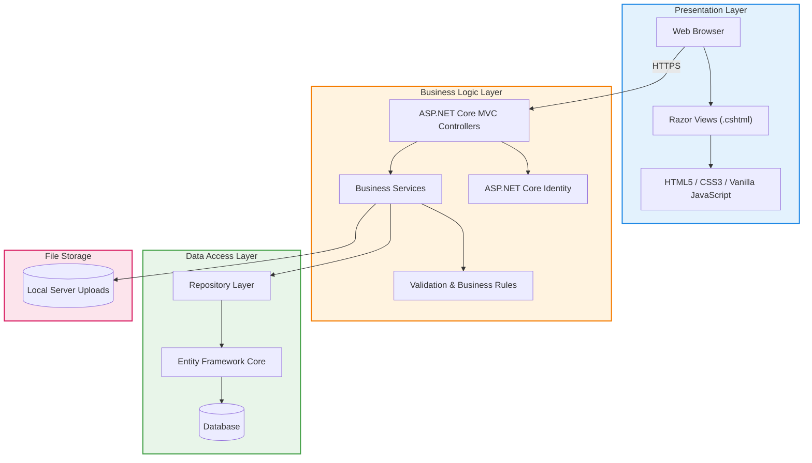

# 09. Architectural Design

## 9.1 Architecture Pattern: Three-Tier

Ruqi Store uses a **three-tier layered architecture** implemented as a **monolithic ASP.NET Core MVC application**. The architecture separates the system into Presentation, Business Logic, and Data Access layers while keeping all application components within a single deployable application.



## Layer Responsibilities

| Layer                    | Main Responsibility                                                                                                                                   |
| ------------------------ | ----------------------------------------------------------------------------------------------------------------------------------------------------- |
| **Presentation Layer**   | Provides the customer and staff user interface through Razor Views, HTML5, CSS3, and Vanilla JavaScript.                                              |
| **Business Logic Layer** | Implements application workflows, validation, authorization, inventory rules, checkout processing, payment management, reviews, and audit operations. |
| **Data Access Layer**    | Handles database access through Repository classes and Entity Framework Core.                                                                         |
| **Database**             | Stores persistent application data using SQLite during development and SQL Server in production.                                                      |
| **File Storage**         | Stores uploaded product images and other supported files within the application server's upload directory.                                            |

---

## 9.2 Technology Stack

| Layer                     | Technology                                   | Justification                                                                                                                                             |
| ------------------------- | -------------------------------------------- | --------------------------------------------------------------------------------------------------------------------------------------------------------- |
| **Frontend**              | HTML5, CSS3, Vanilla JavaScript, Razor Views | Provides a lightweight server-rendered interface without requiring a separate frontend framework.                                                         |
| **Backend**               | ASP.NET Core 8.0 MVC                         | Provides controllers, routing, dependency injection, middleware, authorization, and server-side application logic within a single monolithic application. |
| **Programming Language**  | C#                                           | Primary language used for ASP.NET Core MVC, services, repositories, and domain logic.                                                                     |
| **Data Access**           | Entity Framework Core                        | Provides Code-First development, LINQ queries, migrations, change tracking, and transaction support.                                                      |
| **Development Database**  | SQLite                                       | Provides a lightweight single-file database that simplifies local development and team sharing.                                                           |
| **Production Database**   | SQL Server                                   | Provides a robust relational database platform suitable for production deployment and transactional workloads.                                            |
| **Authentication**        | ASP.NET Core Identity                        | Handles user accounts, password hashing, authentication cookies, password management, and role-based authorization.                                       |
| **Authorization**         | ASP.NET Core MVC Authorization / Roles       | Enforces permissions for Customer, Store Manager, Payment Officer, and Administrator roles.                                                               |
| **API Style**             | Not applicable as a separate REST API        | The system uses MVC Controllers and server-rendered Razor Views rather than a separate API server.                                                        |
| **File Storage**          | Application Server Uploads                   | Product images and supported uploaded files are stored through the application's file-upload mechanism.                                                   |
| **Frontend Framework**    | None                                         | The system does not use React, Angular, Vue, or another SPA framework.                                                                                    |
| **Authentication Tokens** | Not used                                     | The system uses ASP.NET Core Identity authentication cookies rather than JWT or refresh tokens.                                                           |

---

## 9.3 Component Diagram

This diagram illustrates the main components of the Ruqi Store monolithic ASP.NET Core MVC application and how requests flow from the browser through controllers, services, repositories, and Entity Framework Core to the database.
```
graph LR

    subgraph Presentation["Presentation Layer"]
        Home["Catalog / Home"]
        Login["Login / Registration"]
        ProductUI["Product Details"]
        CartUI["Shopping Cart"]
        CheckoutUI["Checkout"]
        OrdersUI["Orders / Tracking"]
        ReviewUI["Product Reviews"]
        AdminUI["Admin / Management Views"]
    end

    subgraph Controllers["MVC Controllers"]
        AccountC["Account Controller"]
        ProductC["Product Controller"]
        CartC["Cart Controller"]
        OrderC["Order Controller"]
        ReviewC["Review Controller"]
        AddressC["Address Controller"]
        ManagerC["Manager Controller"]
        PaymentC["Payment Controller"]
        AdminC["Admin Controller"]
    end

    subgraph Services["Business Services"]
        IdentityS["Identity / Authentication Service"]
        ProductS["Product Service"]
        CartS["Cart Service"]
        OrderS["Order Service"]
        InventoryS["Inventory Service"]
        PaymentS["Payment Service"]
        ReviewS["Review Service"]
        AddressS["Address Service"]
        AuditS["Audit Logging Service"]
        FileS["File Upload Service"]
    end

    subgraph Data["Data Access"]
        UserR["User Repository"]
        ProductR["Product Repository"]
        CartR["Cart Repository"]
        OrderR["Order Repository"]
        PaymentR["Payment Repository"]
        ReviewR["Review Repository"]
        AuditR["Audit Log Repository"]
        EF["Entity Framework Core"]
    end

    DB[("SQLite / SQL Server")]
    Files[("Application Uploads")]

    Home --> ProductC
    Login --> AccountC
    ProductUI --> ProductC
    CartUI --> CartC
    CheckoutUI --> OrderC
    OrdersUI --> OrderC
    ReviewUI --> ReviewC
    AdminUI --> AdminC

    Controllers --> Services

    IdentityS --> UserR
    ProductS --> ProductR
    CartS --> CartR
    OrderS --> OrderR
    OrderS --> InventoryS
    PaymentS --> PaymentR
    ReviewS --> ReviewR
    AddressS --> UserR
    AuditS --> AuditR
    FileS --> Files

    UserR --> EF
    ProductR --> EF
    CartR --> EF
    OrderR --> EF
    PaymentR --> EF
    ReviewR --> EF
    AuditR --> EF

    EF --> DB

    style Presentation fill:#e3f2fd,stroke:#1e88e5,stroke-width:2px
    style Controllers fill:#fff3e0,stroke:#f57c00,stroke-width:2px
    style Services fill:#e8f5e9,stroke:#43a047,stroke-width:2px
    style Data fill:#f5f5f5,stroke:#9e9e9e,stroke-width:2px

```
## 9.4 Architectural Decisions

| Decision Topic               | Selected Approach                                  | Alternatives Considered           | Rationale                                                                                                                                         |
| ---------------------------- | -------------------------------------------------- | --------------------------------- | ------------------------------------------------------------------------------------------------------------------------------------------------- |
| **Architecture Pattern**     | Monolithic Three-Tier ASP.NET Core MVC             | Microservices                     | A monolithic architecture provides simpler deployment, development, debugging, and transaction management for the project's scope.                |
| **Frontend Rendering**       | Server-Side Rendering with Razor Views             | React SPA / Client-Side Rendering | Razor Views keep the presentation layer integrated with ASP.NET Core MVC and avoid the complexity of maintaining a separate frontend application. |
| **Backend Framework**        | ASP.NET Core 8.0 MVC                               | Node.js + Express                 | ASP.NET Core provides integrated MVC, dependency injection, middleware, Identity, authorization, and EF Core support.                             |
| **Database Access**          | Entity Framework Core                              | Raw SQL / Separate ORM            | EF Core provides LINQ, Code-First migrations, change tracking, relationships, and transaction support.                                            |
| **Database System**          | SQLite for Development / SQL Server for Production | MongoDB / Other NoSQL Databases   | The relational model is appropriate for products, carts, orders, payments, reviews, and audit records requiring strong referential integrity.     |
| **Authentication Style**     | ASP.NET Core Identity Cookies                      | JWT Tokens                        | Identity provides secure cookie-based authentication and integrates directly with ASP.NET Core MVC authorization and roles.                       |
| **Authorization**            | Role-Based Authorization                           | Custom Permission System          | ASP.NET Core role authorization provides a clear mechanism for enforcing permissions across system roles.                                         |
| **File Storage**             | Application Server Uploads                         | AWS S3                            | Local application storage is sufficient for the current project scope and avoids unnecessary external infrastructure.                             |
| **Caching**                  | Not implemented                                    | Redis                             | Redis is outside the current project scope and is not required for the planned system functionality.                                              |
| **External Payment Gateway** | Not integrated                                     | Stripe / PayPal                   | Payment processing is managed through the system's Payment Officer workflow rather than an external card-payment gateway.                         |
| **API Architecture**         | No separate REST API                               | REST API / Node.js API            | The application uses MVC Controllers and Razor Views in a single monolithic application.                                                          |

---

## 9.5 Deployment View

The production deployment consists of a web application server running the monolithic ASP.NET Core MVC application and a SQL Server database.

During development, SQLite is used as the local database.
```
graph TB

    subgraph Clients["Client Devices"]
        PC["Desktop Browser"]
        Tablet["Tablet Browser"]
        Mobile["Mobile Browser"]
    end

    subgraph Application["ASP.NET Core Application Server"]
        ASP["Ruqi Store ASP.NET Core 8.0 MVC"]
        Controllers["MVC Controllers"]
        Services["Business Services"]
        Repositories["Repositories"]
        Uploads[("Uploads Directory")]
    end

    subgraph Database["Database Layer"]
        SQLite[("SQLite - Development")]
        SQLServer[("SQL Server - Production")]
    end

    PC -->|HTTPS| ASP
    Tablet -->|HTTPS| ASP
    Mobile -->|HTTPS| ASP

    ASP --> Controllers
    Controllers --> Services
    Services --> Repositories
    Repositories --> SQLServer
    ASP --> Uploads

    ASP -.->|Development Environment| SQLite

    style Clients fill:#e3f2fd,stroke:#1e88e5,stroke-width:2px
    style Application fill:#fff3e0,stroke:#f57c00,stroke-width:2px
    style Database fill:#e8f5e9,stroke:#43a047,stroke-width:2px
```
## Deployment Characteristics

* The system is deployed as a **single monolithic ASP.NET Core MVC application**.
* Users access the system through standard web browsers.
* Communication between clients and the application server is protected using **HTTPS**.
* **SQLite** is used during development because it provides a lightweight, single-file database.
* **SQL Server** is planned for the production environment.
* Entity Framework Core migrations maintain schema consistency between environments.
* Uploaded product images and supported files are stored through the application's upload directory.
* No separate Node.js server, React application, REST API server, Redis cluster, AWS S3 bucket, or external payment gateway is required by the current architecture.

---

## 9.6 Security Architecture

The architecture incorporates the following security mechanisms:

| Security Mechanism           | Implementation                                                                                  |
| ---------------------------- | ----------------------------------------------------------------------------------------------- |
| **Authentication**           | ASP.NET Core Identity with secure authentication cookies.                                       |
| **Password Security**        | ASP.NET Core Identity password hashing and password policy mechanisms.                          |
| **Authorization**            | Role-Based Access Control using ASP.NET Core MVC `[Authorize]` attributes.                      |
| **CSRF Protection**          | ASP.NET Core antiforgery tokens using `[ValidateAntiForgeryToken]` where applicable.            |
| **HTTPS**                    | HTTPS enforcement protects communication between the browser and application server.            |
| **Cookie Security**          | Authentication cookies are configured with appropriate security settings such as `HttpOnly`.    |
| **SQL Injection Protection** | Entity Framework Core parameterized queries and LINQ expressions.                               |
| **XSS Protection**           | Razor Views automatically HTML-encode rendered values by default.                               |
| **Ownership Isolation**      | Service and controller authorization checks ensure customers can access only their own records. |
| **Auditability**             | Administrative and configured sensitive operations are recorded in append-only audit logs.      |

---

[← Previous: Database Design](./08-database-design.md) | [Back to Index](./00-index.md) | [Next: Detailed Design →](./10-detailed-design.md)
