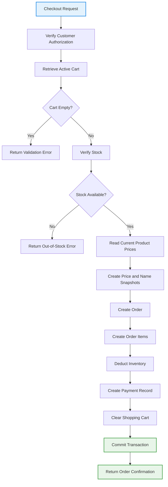

# 10. Detailed Class Design & API Contracts

## 10.1 Design Patterns Applied

The Ruqi Store architecture applies established software design patterns to maintain a clean separation of concerns, improve maintainability, and support the business requirements of the system.

| Pattern | Category | Where Applied | Problem Solved |
| :--- | :--- | :--- | :--- |
| **Repository** | Structural | Data Access Layer | Abstracts database operations behind repository interfaces and isolates business services from direct database access. |
| **MVC** | Architectural | ASP.NET Core MVC | Separates request handling, presentation, and application logic through Controllers, Services, and Razor Views. |
| **Service Layer** | Architectural | Business Logic Layer | Centralizes business rules such as checkout, inventory validation, payment processing, reviews, and address management. |
| **Unit of Work / Transaction** | Behavioral | Checkout & Order Processing | Ensures inventory updates, order creation, order items, and cart cleanup are completed atomically. |
| **Strategy** | Behavioral | Validation / Business Rules | Allows business rules and calculation logic to be separated into focused components when multiple rules or policies are required. |

---

## 10.2 SOLID Principles in Practice

### Single Responsibility Principle (SRP)

Each service is responsible for one cohesive area of the application.

Examples include:

- `ProductService` manages product catalog operations.
- `CartService` manages shopping cart operations.
- `OrderService` manages order creation and order lifecycle operations.
- `InventoryService` manages stock validation and inventory updates.
- `PaymentService` manages payment-related operations.
- `ReviewService` manages product reviews and review eligibility.
- `AddressService` manages saved customer addresses.
- `AuditLogService` records audited system actions.
- `FileUploadService` manages uploaded product images and supported files.

Each service therefore has a focused responsibility and a limited number of reasons to change.

---

### Open/Closed Principle (OCP)

Business rules are designed so that new validation or calculation policies can be introduced without significantly modifying existing checkout workflows.

For example, a calculation strategy can be represented through an interface:

```csharp
public interface IPriceCalculationStrategy
{
    decimal Calculate(decimal originalTotal);
}

public class StandardPriceStrategy : IPriceCalculationStrategy
{
    public decimal Calculate(decimal originalTotal)
    {
        return originalTotal;
    }
}

public class PercentageDiscountStrategy : IPriceCalculationStrategy
{
    public decimal Calculate(decimal originalTotal)
    {
        return originalTotal * 0.90m;
    }
}
```

## Liskov Substitution Principle (LSP)

Interfaces and abstractions should allow implementations to be substituted without changing the expected behavior of the calling service.

For example, any repository implementing `IProductRepository` should provide the operations expected by `ProductService`.

```csharp
public interface IProductRepository
{
    Task<Product?> GetByIdAsync(int productId);

    Task<IEnumerable<Product>> GetActiveProductsAsync();

    Task AddAsync(Product product);

    Task UpdateAsync(Product product);
}
```

---

### Interface Segregation Principle (ISP)

Services and repositories expose focused interfaces instead of forcing classes to depend on methods they do not use.

For example:

```csharp
public interface ICartService
{
    Task<CartDto> GetActiveCartAsync(string userId);

    Task<bool> AddToCartAsync(
        string userId,
        int productId,
        int quantity
    );

    Task<bool> UpdateCartItemQuantityAsync(
        string userId,
        int cartItemId,
        int newQuantity
    );

    Task<bool> RemoveFromCartAsync(
        string userId,
        int cartItemId
    );

    Task<bool> ClearCartAsync(string userId);
}
```

---

### Dependency Inversion Principle (DIP)

Controllers and business services depend on abstractions rather than directly creating database or infrastructure objects.

ASP.NET Core Dependency Injection is used to provide required services and repositories.

```csharp
public class CartController : Controller
{
    private readonly ICartService _cartService;

    public CartController(ICartService cartService)
    {
        _cartService = cartService;
    }
}
```

This improves testability, maintainability, and separation of concerns.

---

## 10.3 Core Service Contracts

### A. IProductService

**Responsibility:**
Manages product catalog operations, product retrieval, filtering, and product administration.

```csharp
public interface IProductService
{
    Task<IEnumerable<ProductDto>> GetActiveProductsAsync();

    Task<ProductDto?> GetProductByIdAsync(int productId);

    Task<IEnumerable<ProductDto>> SearchProductsAsync(
        string? searchTerm,
        int? categoryId,
        decimal? minPrice,
        decimal? maxPrice
    );

    Task<int> CreateProductAsync(ProductCreateDto model);

    Task<bool> UpdateProductAsync(
        int productId,
        ProductUpdateDto model
    );

    Task<bool> DeactivateProductAsync(int productId);
}
```

---

### B. ICartService

**Responsibility:**
Manages the customer's persistent shopping cart and validates product quantities before checkout.

```csharp
public interface ICartService
{
    Task<CartDto> GetActiveCartAsync(
        string userId
    );

    Task<bool> AddToCartAsync(
        string userId,
        int productId,
        int quantity
    );

    Task<bool> UpdateCartItemQuantityAsync(
        string userId,
        int cartItemId,
        int newQuantity
    );

    Task<bool> RemoveFromCartAsync(
        string userId,
        int cartItemId
    );

    Task<bool> ClearCartAsync(
        string userId
    );
}
```

---

### C. IOrderService

**Responsibility:**
Creates orders, processes checkout transactions, manages order retrieval, and handles fulfillment status changes.

```csharp
public interface IOrderService
{
    Task<OrderDto?> GetOrderByIdAsync(
        int orderId,
        string userId
    );

    Task<IEnumerable<OrderDto>> GetCustomerOrdersAsync(
        string userId
    );

    Task<int> CreateOrderAsync(
        string userId,
        CheckoutDto checkout
    );

    Task<bool> UpdateFulfillmentStatusAsync(
        int orderId,
        FulfillmentStatus status,
        string managerUserId
    );
}
```

---

### D. IPaymentService

**Responsibility:**
Manages payment records and payment status operations performed by authorized Payment Officers.

```csharp
public interface IPaymentService
{
    Task<PaymentDto?> GetPaymentByOrderIdAsync(
        int orderId
    );

    Task<bool> ApprovePaymentAsync(
        int orderId,
        string paymentOfficerId
    );

    Task<bool> RejectPaymentAsync(
        int orderId,
        string paymentOfficerId
    );

    Task<IEnumerable<PaymentLogDto>> GetPaymentLogsAsync(
        int orderId
    );
}
```

---

### E. IReviewService

**Responsibility:**
Manages customer product reviews and validates review eligibility.

```csharp
public interface IReviewService
{
    Task<IEnumerable<ProductReviewDto>> GetProductReviewsAsync(
        int productId
    );

    Task<bool> CanReviewProductAsync(
        string userId,
        int productId
    );

    Task<int> AddReviewAsync(
        string userId,
        int productId,
        int rating,
        string? comment
    );

    Task<bool> UpdateVisibilityAsync(
        int reviewId,
        ReviewVisibility visibility,
        string administratorId
    );
}
```

---

### F. IAddressService

**Responsibility:**
Manages saved customer shipping addresses and enforces the maximum address limit.

```csharp
public interface IAddressService
{
    Task<IEnumerable<AddressDto>> GetAddressesAsync(
        string userId
    );

    Task<int> AddAddressAsync(
        string userId,
        AddressCreateDto model
    );

    Task<bool> UpdateAddressAsync(
        string userId,
        int addressId,
        AddressUpdateDto model
    );

    Task<bool> DeleteAddressAsync(
        string userId,
        int addressId
    );

    Task<bool> SetDefaultAddressAsync(
        string userId,
        int addressId
    );
}
```

---

### G. IAuditLogService

**Responsibility:**
Records administrative and other configured system actions in the append-only audit log.

```csharp
public interface IAuditLogService
{
    Task LogAsync(
        string userId,
        string action,
        string entityName,
        int? entityId
    );

    Task<IEnumerable<AuditLogDto>> GetLogsAsync();
}
```

---

### H. IFileUploadService

**Responsibility:**
Handles product image uploads and file management within the application's upload directory.

```csharp
public interface IFileUploadService
{
    Task<string> SaveProductImageAsync(
        IFormFile file
    );

    Task<bool> DeleteFileAsync(
        string filePath
    );
}
```

---

## 10.4 Core Data Transfer Objects

### A. CartItemDto

**Purpose:**
Represents a single product displayed in the customer's shopping cart.

```csharp
public class CartItemDto
{
    public int CartItemId { get; set; }

    public int ProductId { get; set; }

    public string ProductName { get; set; }

    public decimal UnitPrice { get; set; }

    public int Quantity { get; set; }

    public decimal SubTotal =>
        UnitPrice * Quantity;
}
```

---

### B. CheckoutDto

**Purpose:**
Contains the information required to complete a customer's checkout request.

```csharp
public class CheckoutDto
{
    public int AddressId { get; set; }

    public string ShippingAddressSnapshot { get; set; }
}
```

---

### C. OrderDto

**Purpose:**
Represents order information returned to authorized users.

```csharp
public class OrderDto
{
    public int OrderId { get; set; }

    public string UserId { get; set; }

    public DateTime OrderDate { get; set; }

    public FulfillmentStatus FulfillmentStatus { get; set; }

    public PaymentStatus PaymentStatus { get; set; }

    public decimal TotalAmount { get; set; }

    public string ShippingAddressSnapshot { get; set; }

    public IEnumerable<OrderItemDto> Items { get; set; }
}
```

---

### D. OrderItemDto

**Purpose:**
Represents an immutable purchase line within an order.

```csharp
public class OrderItemDto
{
    public int OrderItemId { get; set; }

    public int ProductId { get; set; }

    public string ProductNameSnapshot { get; set; }

    public decimal UnitPrice { get; set; }

    public int Quantity { get; set; }

    public decimal SubTotal =>
        UnitPrice * Quantity;
}
```

---

# 10.5 System Validation & Business Rules

Before any checkout transaction is committed, the following validation rules and pipeline operations are strictly enforced.

## Checkout Validation Pipeline

| Step | Validation Action                                                                 |
| ---: | --------------------------------------------------------------------------------- |
|    1 | Verify that the customer is authenticated and authorized to perform checkout.     |
|    2 | Retrieve the customer's persistent shopping cart.                                 |
|    3 | Verify that the cart is not empty.                                                |
|    4 | Verify product availability and requested stock quantities.                       |
|    5 | Read the current product prices from the catalog.                                 |
|    6 | Capture the current product name and price into the order item snapshots.         |
|    7 | Create the `Order` record.                                                        |
|    8 | Create all associated `OrderItem` records.                                        |
|    9 | Deduct the purchased quantities from inventory.                                   |
|   10 | Create or update the associated payment record according to the payment workflow. |
|   11 | Clear the customer's shopping cart.                                               |
|   12 | Commit all operations atomically through an Entity Framework Core transaction.    |
|   13 | Record required audit or payment log entries.                                     |

---

## Checkout Workflow

The checkout workflow follows the validation, snapshot, transaction, payment, and cart-cleanup operations described below.

### Stock Verification

Before creating an order, the application verifies the available inventory for every product in the customer's shopping cart.

If the requested quantity exceeds the available stock, checkout is rejected and the customer receives a validation message.

The system must never allow:

```text
stock_quantity < 0
```

---

### Price Snapshot Pattern

During checkout, the current product price is copied into:

```text
OrderItem.UnitPrice
```

The current product name is copied into:

```text
OrderItem.ProductNameSnapshot
```

These values become historical snapshots and are not changed when the product catalog is updated later.

---

### Atomic Transactions

All critical checkout operations run within a single Entity Framework Core database transaction.

The transaction includes:

1. Stock validation.
2. Inventory deduction.
3. Order creation.
4. Order item creation.
5. Price and product-name snapshot creation.
6. Payment record creation or update.
7. Shopping cart cleanup.

If any operation fails, the transaction is rolled back to prevent inconsistent inventory, incomplete orders, or partially processed checkout data.

---

### Ownership Validation

Customer-owned records are always queried using the authenticated user's identity.

For example:

```csharp
var order = await _context.Orders
    .FirstOrDefaultAsync(
        o => o.OrderId == orderId &&
             o.UserId == userId
    );
```

This prevents a customer from accessing another customer's order by changing an identifier in the request.

---

# 10.6 MVC Controller Contracts

Ruqi Store does not expose a separate REST API server. The application uses **ASP.NET Core MVC Controllers** that process browser requests and return Razor Views or appropriate HTTP responses.

## AccountController

**Purpose:**
Handles account registration, login, logout, and account-related operations through ASP.NET Core Identity.

```csharp
public class AccountController : Controller
{
    [HttpGet]
    public IActionResult Login();

    [HttpPost]
    [ValidateAntiForgeryToken]
    public Task<IActionResult> Login(LoginViewModel model);

    [HttpGet]
    public IActionResult Register();

    [HttpPost]
    [ValidateAntiForgeryToken]
    public Task<IActionResult> Register(RegisterViewModel model);

    [HttpPost]
    [ValidateAntiForgeryToken]
    public Task<IActionResult> Logout();
}
```

---

## CartController

**Purpose:**
Manages the authenticated customer's persistent shopping cart.

```csharp
[Authorize(Roles = "Customer")]
public class CartController : Controller
{
    [HttpGet]
    public Task<IActionResult> Index();

    [HttpPost]
    [ValidateAntiForgeryToken]
    public Task<IActionResult> Add(
        int productId,
        int quantity
    );

    [HttpPost]
    [ValidateAntiForgeryToken]
    public Task<IActionResult> Update(
        int cartItemId,
        int quantity
    );

    [HttpPost]
    [ValidateAntiForgeryToken]
    public Task<IActionResult> Remove(
        int cartItemId
    );
}
```

---

## OrderController

**Purpose:**
Handles checkout, order creation, and customer order tracking.

```csharp
[Authorize]
public class OrderController : Controller
{
    [HttpGet]
    public Task<IActionResult> Index();

    [HttpGet]
    public Task<IActionResult> Details(int id);

    [HttpGet]
    public Task<IActionResult> Checkout();

    [HttpPost]
    [ValidateAntiForgeryToken]
    public Task<IActionResult> PlaceOrder(
        CheckoutDto model
    );
}
```

---

## PaymentController

**Purpose:**
Allows authorized Payment Officers to process and manage payment status.

```csharp
[Authorize(Roles = "Payment Officer")]
public class PaymentController : Controller
{
    [HttpGet]
    public Task<IActionResult> Index();

    [HttpPost]
    [ValidateAntiForgeryToken]
    public Task<IActionResult> Approve(int orderId);

    [HttpPost]
    [ValidateAntiForgeryToken]
    public Task<IActionResult> Reject(int orderId);
}
```

---

## ManagerController

**Purpose:**
Allows Store Managers to manage order fulfillment operations.

```csharp
[Authorize(Roles = "Store Manager")]
public class ManagerController : Controller
{
    [HttpGet]
    public Task<IActionResult> Orders();

    [HttpPost]
    [ValidateAntiForgeryToken]
    public Task<IActionResult> UpdateFulfillmentStatus(
        int orderId,
        FulfillmentStatus status
    );
}
```

Store Managers can modify fulfillment status but cannot modify payment status.

---

## AdminController

**Purpose:**
Provides administrative management and oversight functionality.

```csharp
[Authorize(Roles = "Administrator")]
public class AdminController : Controller
{
    [HttpGet]
    public IActionResult Index();

    [HttpGet]
    public Task<IActionResult> Users();

    [HttpGet]
    public Task<IActionResult> Orders();

    [HttpGet]
    public Task<IActionResult> Reviews();

    [HttpGet]
    public Task<IActionResult> AuditLogs();

    [HttpGet]
    public Task<IActionResult> Reports();

    [HttpPost]
    [ValidateAntiForgeryToken]
    public Task<IActionResult> ActivateUser(
        string userId
    );

    [HttpPost]
    [ValidateAntiForgeryToken]
    public Task<IActionResult> DeactivateUser(
        string userId
    );
}
```

---

# 10.7 Error Handling Strategy

The Ruqi Store system follows a layered error-handling approach to maintain system stability, provide meaningful validation feedback, and protect sensitive internal information.

| Layer                    | Responsibility                                                                                                    | Example                                                                                   |
| ------------------------ | ----------------------------------------------------------------------------------------------------------------- | ----------------------------------------------------------------------------------------- |
| **Controller**           | Validates request input and returns appropriate MVC responses or validation messages.                             | Returns the checkout view with validation errors when stock is unavailable.               |
| **Service**              | Enforces business rules and handles domain-level failures.                                                        | Rejects checkout when stock is insufficient or a customer exceeds the five-address limit. |
| **Repository / EF Core** | Handles database operations and persistence failures.                                                             | Detects database constraint violations or transaction failures.                           |
| **Middleware**           | Handles unexpected application failures globally and prevents internal implementation details from being exposed. | Logs unexpected errors and returns a generic error page in production.                    |

---

## Common Application Errors

| Error                         | Description                                                                                |
| ----------------------------- | ------------------------------------------------------------------------------------------ |
| **Unauthorized**              | The user is not authenticated and must log in.                                             |
| **Forbidden**                 | The authenticated user does not have the required role or permission.                      |
| **Not Found**                 | The requested product, order, review, or other entity does not exist or is not accessible. |
| **Validation Error**          | Submitted data violates application validation rules.                                      |
| **Insufficient Stock**        | Requested quantity exceeds available inventory.                                            |
| **Invalid Status Transition** | Requested order fulfillment status change is not permitted by the business rules.          |
| **Review Not Eligible**       | Customer has not received a delivered order containing the reviewed product.               |
| **Address Limit Exceeded**    | Customer already has the maximum allowed five saved addresses.                             |
| **Database Error**            | An unexpected persistence or transaction failure occurred.                                 |

---

# 10.8 Authorization & Role Contracts

The system defines four primary roles:

```text
Customer
Store Manager
Payment Officer
Administrator
```

Role-based access is enforced using ASP.NET Core MVC authorization.

### Customer

Customers can:

* Browse the product catalog.
* Search and filter products.
* View product details.
* Manage their shopping cart.
* Manage saved addresses.
* Place orders.
* Track their own orders.
* Submit eligible product reviews.
* View their own payment-related order information.

### Store Manager

Store Managers can:

* Manage product catalog operations according to assigned permissions.
* Monitor inventory.
* View and manage orders.
* Update order fulfillment status.
* Access operational management functions.

Store Managers **cannot modify payment status**.

### Payment Officer

Payment Officers can:

* View payment-related order information.
* Process payments.
* Approve payments.
* Reject payments.
* Record payment actions in `payment_logs`.

### Administrator

Administrators can:

* Manage user accounts.
* Activate and deactivate users.
* Assign or revoke system roles according to administrative rules.
* Review system orders.
* Moderate product reviews.
* View reports.
* View audit logs.
* Perform authorized administrative operations.

Administrative operations are protected using:

```csharp
[Authorize(Roles = "Administrator")]
```

---

# 10.9 System Scalability Considerations

Ruqi Store is designed as a monolithic ASP.NET Core MVC application suitable for the expected project scope.

The application can be scaled vertically by increasing the resources available to the application server and database server.

If future traffic requirements increase, the application can also be deployed across multiple application instances behind a load balancer, provided shared production infrastructure is configured appropriately.

The architecture intentionally avoids unnecessary infrastructure such as:

* Separate Node.js servers.
* React SPA deployments.
* Redis clusters.
* AWS S3 infrastructure.
* Microservice deployments.
* External API gateways.

These technologies are outside the current project scope.

---

[← Previous: Architecture](./09-architecture.md) | [Back to Index](./00-index.md) | [Next: UI/UX Design →](./11-ui-ux-design.md)
