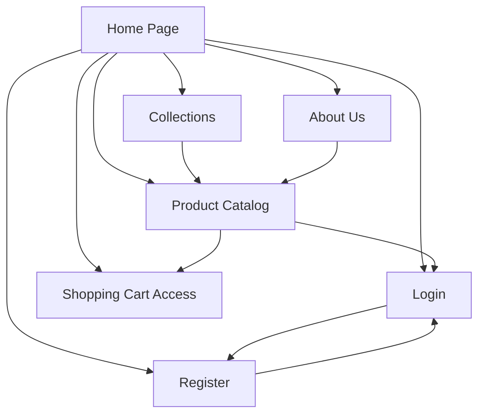

# 11 — UI/UX Design & Frontend Specifications

## Ruqi Store — ASP.NET Core MVC

---

## 11.1 Design Principles

The Ruqi Store interface follows responsive e-commerce and usability principles to provide a clear, elegant, accessible, and consistent furniture shopping experience.

| Principle                          | Application in Ruqi Store                                                                                                            |
| ---------------------------------- | ------------------------------------------------------------------------------------------------------------------------------------ |
| **Consistency**                    | Shared navigation, typography, buttons, product cards, spacing, headers, and footer structure are used across the main public pages. |
| **Visual Simplicity**              | The interface uses a clean architectural style with generous whitespace and clear content hierarchy.                                 |
| **Visibility of System Status**    | Login, registration, product availability, cart access, and language controls are clearly visible to the user.                       |
| **Feedback**                       | Forms provide validation feedback, while product and account actions provide clear user responses.                                   |
| **Error Prevention & Recovery**    | Required form fields, password confirmation, authentication validation, and product availability checks prevent invalid operations.  |
| **Accessibility**                  | Interactive controls use descriptive labels, readable text, visible focus states, and keyboard-accessible navigation.                |
| **Responsive Design**              | Public pages adapt to mobile, tablet, and desktop screen sizes.                                                                      |
| **RTL / LTR Support**              | Arabic uses RTL layout while English uses LTR layout through ASP.NET Core localization and CSS logical properties.                   |
| **Furniture-Focused Presentation** | Product images, collections, rooms, materials, and architectural design concepts are visually emphasized throughout the interface.   |

---

## 11.2 Navigation Structure

The current public navigation structure is based on the implemented Ruqi Store screens.



### Main Navigation

The primary navigation contains:

* **Home**
* **Products**
* **Collections**
* **About Us**
* **Login**
* **Register**
* **Language Toggle**
* **Shopping Cart**

The navigation is shared across the main public pages to provide a consistent browsing experience.

---

## 11.3 Page Layouts & Wireframes

The following wireframes represent the actual UI screens defined for the current Ruqi Store frontend.

---

### A. Home Page

```text
┌─────────────────────────────────────────────────────────────────┐
│ [R] Ruqi Store   HOME  PRODUCTS  COLLECTIONS  ABOUT US          │
│                                           LOGIN  [ REGISTER ] 文A 🛒│
├─────────────────────────────────────────────────────────────────┤
│                                                                 │
│   Modern Living,                                                │
│   Timeless Designs                                              │
│                                                                 │
│   We dress your home's aesthetic with carefully                 │
│   curated pieces that combine architectural                     │
│   precision and quiet luxury.                                   │
│                                                                 │
│   [ EXPLORE COLLECTION ]                                        │
│                                                                 │
├─────────────────────────────────────────────────────────────────┤
│                                                                 │
│ ┌──────────────┐ ┌──────────────┐  OUR PHILOSOPHY               │
│ │              │ │              │                               │
│ │  [Image 1]   │ │  [Image 2]   │  Architectural precision     │
│ │  Coffee      │ │  Interior    │  in every detail.             │
│ │  Tables      │ │  Console     │                               │
│ │              │ │              │  We believe furniture is the  │
│ └──────────────┘ └──────────────┘  architecture of interior...  │
│                                                                 │
│                                    DISCOVER ALL ────>           │
│                                                                 │
├─────────────────────────────────────────────────────────────────┤
│ Featured Spaces                                                 │
│                                                                 │
│  <  ┌─────────────┐   ┌─────────────┐   ┌─────────────┐  >      │
│     │ [Bedroom]   │   │ [Kitchen]   │   │ [Living]    │         │
│     └─────────────┘   └─────────────┘   └─────────────┘         │
│                                                                 │
├─────────────────────────────────────────────────────────────────┤
│ Ruqi Store           QUICK LINKS    CONTACT        FOLLOW US    │
│                       Products       📍 Gaza, Palestine         │
│ تصنع مساحات تفيض      Collections    📞 +970 59 123 4567        │
│ بالأناقة والفخامة     About Us       ✉️ info@ruqi-store.com     │
│                       Contact                                   │
│─────────────────────────────────────────────────────────────────│
│ © 2026 Ruqi Store — All Rights Reserved                         │
└─────────────────────────────────────────────────────────────────┘
```

### Home Page Components

The Home Page contains:

* Brand and primary navigation.
* Hero section.
* Main marketing statement.
* **Explore Collection** call-to-action.
* Featured furniture imagery.
* **Our Philosophy** section.
* Featured Spaces section.
* Room categories such as:

  * Bedroom
  * Kitchen
  * Living
* Footer with navigation and contact information.

### Primary Actions

| Action                 | Purpose                                                        |
| ---------------------- | -------------------------------------------------------------- |
| **Explore Collection** | Navigates the user toward the available furniture collections. |
| **Products**           | Opens the product catalog.                                     |
| **Collections**        | Opens the curated collections page.                            |
| **About Us**           | Opens the company information page.                            |
| **Login**              | Opens the authentication page.                                 |
| **Register**           | Opens the account creation page.                               |
| **Cart**               | Provides access to the shopping cart.                          |
| **Language Toggle**    | Switches between supported interface languages.                |

---

### B. Product Catalog Page

```text
┌─────────────────────────────────────────────────────────────────┐
│ [R] Ruqi Store   HOME  PRODUCTS  COLLECTIONS  ABOUT US          │
│                                           LOGIN  [ REGISTER ] 文A 🛒│
├─────────────────────────────────────────────────────────────────┤
│                                                                 │
│   [ Search for a specific piece... ]  [ ARCHITECTURAL SEARCH ]  │
│                                                                 │
├─────────────────────────────────────────────────────────────────┤
│ PRODUCTS CATALOG                                                │
│                                                                 │
│  < ┌──────────────────────┐ ┌──────────────────────┐ >          │
│    │ [Image]  LIVING ROOM │ │ [Image]  DINING ROOM │            │
│    ├──────────────────────┤ ├──────────────────────┤            │
│    │ [ 🛒 LOGIN TO ADD ]  │ │ [ 🛒 LOGIN TO ADD ]  │            │
│    │ ₪ 500                │ │ ₪ 200                │            │
│    │ طاولة كونسول بتصميم  │ │ جزيرة مطبخ فاخرة     │            │
│    │ بسيط                 │ │                      │            │
│    │ ☆☆☆☆☆   FULL DETAILS │ │ ☆☆☆☆☆   FULL DETAILS │            │
│    └──────────────────────┘ └──────────────────────┘            │
│                                                                 │
│    ┌──────────────────────┐ ┌──────────────────────┐            │
│    │ [Image]  LIVING ROOM │ │ [Image]  LIVING ROOM │            │
│    ├──────────────────────┤ ├──────────────────────┤            │
│    │ [ 🛒 LOGIN TO ADD ]  │ │ [ 🛒 LOGIN TO ADD ]  │            │
│    │ ₪ 150                │ │ ₪ 300                │            │
│    │ كنب زاوية (L-Shape)  │ │ كرسي أرجوحة (بيضة)   │            │
│    │ باللون الكريمي       │ │ من الخيزران          │            │
│    │ ☆☆☆☆☆   FULL DETAILS │ │ ☆☆☆☆☆   FULL DETAILS │            │
│    └──────────────────────┘ └──────────────────────┘            │
│                                                                 │
│    ┌──────────────────────┐ ┌──────────────────────┐            │
│    │ [Image]  DINING ROOM │ │ [Image]  LIVING ROOM │            │
│    ├──────────────────────┤ ├──────────────────────┤            │
│    │ [ 🛒 LOGIN TO ADD ]  │ │ [ 🛒 LOGIN TO ADD ]  │            │
│    │ ₪ 400                │ │ ₪ 120                │            │
│    │ طقم طعام رخامي دائم   │ │ خزانة ركن القهوة     │            │
│    │                      │ │ المدمجة              │            │
│    └──────────────────────┘ └──────────────────────┘            │
│                                                                 │
│    ┌──────────────────────┐ ┌──────────────────────┐            │
│    │ [Image]  LIVING ROOM │ │ [Image]  ACCENT&DECOR│            │
│    ├──────────────────────┤ ├──────────────────────┤            │
│    │ [ 🛒 LOGIN TO ADD ]  │ │ [ 🛒 LOGIN TO ADD ]  │            │
│    │ ₪ 140                │ │ ₪ 260                │            │
│    │ كرسي مبتكر على شكل   │ │ تماثيل ومزهرية       │            │
│    │ ورقة الشجر           │ │ سيراميك تجريدية      │            │
│    └──────────────────────┘ └──────────────────────┘            │
├─────────────────────────────────────────────────────────────────┤
│ Ruqi Store           QUICK LINKS    CONTACT        FOLLOW US    │
│                       Products       📍 Gaza, Palestine         │
│ تصنع مساحات تفيض      Collections    📞 +970 59 123 4567        │
│ بالأناقة والفخامة     About Us       ✉️ info@ruqi-store.com     │
│                       Contact                                   │
│─────────────────────────────────────────────────────────────────│
│ © 2026 Ruqi Store — All Rights Reserved                         │
└─────────────────────────────────────────────────────────────────┘
```

### Product Catalog Components

The Product Catalog provides:

* Product search field.
* Architectural Search action.
* Product cards.
* Product image.
* Product category.
* Product name.
* Product price in Palestinian Shekels.
* Product rating.
* Full Details action.
* Login-required cart action.

### Product Card Structure

Each product card follows a consistent structure:

```text
Product Image
     ↓
Category
     ↓
Login to Add / Cart Action
     ↓
Price
     ↓
Product Name
     ↓
Rating
     ↓
Full Details
```

### Authentication-Aware Cart Action

For unauthenticated users, the cart action is displayed as:

```text
[ 🛒 LOGIN TO ADD ]
```

The user must authenticate before adding products to the shopping cart.

---

### C. Login Page

```text
┌─────────────────────────────────────────────────────────────────┐
│                                                                 │
│                   R U Q I                                       │
│             INTERIOR ARCHITECTURE                               │
│                                                                 │
│             Welcome Back                                        │
│                                                                 │
│             EMAIL ADDRESS                                       │
│             [ name@domain.com                         ]         │
│                                                                 │
│             PASSWORD                  FORGOT PASSWORD?          │
│             [ ********************                    ]         │
│                                                                 │
│             [ ] REMEMBER ME ON THIS DEVICE                      │
│                                                                 │
│             [      ARCHITECTURAL LOGIN      ]                   │
│                                                                 │
│             Don't have an account? CREATE NEW ACCOUNT           │
│                                                                 │
└─────────────────────────────────────────────────────────────────┘
```

### Login Form

The Login page contains:

* Ruqi branding.
* Welcome message.
* Email address field.
* Password field.
* Forgot Password action.
* Remember Me option.
* Architectural Login button.
* Link to create a new account.

### Authentication Behavior

Authentication is handled by **ASP.NET Core Identity**.

The frontend does not directly process or store passwords. Authentication requests are submitted to the ASP.NET Core MVC application and processed by the Identity authentication system.

---

### D. Collections Page

```text
┌─────────────────────────────────────────────────────────────────┐
│ [R] Ruqi Store   HOME  PRODUCTS  COLLECTIONS  ABOUT US          │
│                                           LOGIN  [ REGISTER ] 文A 🛒│
├─────────────────────────────────────────────────────────────────┤
│                                                                 │
│                    Our Curated Collections                      │
│                                                                 │
│   Discover worlds of design where architectural precision meets │
│   quiet luxury. Each collection is a story told through wood,   │
│   fabric, and light.                                            │
│                                                                 │
├─────────────────────────────────────────────────────────────────┤
│                                                                 │
│   ┌───────────────────────────┐   ┌───────────────────────────┐ │
│   │ [Image]  [ NEW ]          │   │ [Image]                   │ │
│   └───────────────────────────┘   └───────────────────────────┘ │
│          Monolith Series                 Haven Collection       │
│   Designs inspired by Brutalist   Centered around the concept   │
│   architecture, featuring bold    of serenity and purity. Calm  │
│   lines and solid masses...       earthy colors and fabrics...  │
│          VIEW PIECES <-                  VIEW PIECES <-         │
│                                                                 │
│   ┌───────────────────────────┐   ┌───────────────────────────┐ │
│   │ [Image]                   │   │ [Image]                   │ │
│   └───────────────────────────┘   └───────────────────────────┘ │
│     Essentials of Excellence             Modern Legacy          │
│   A collection focused on         Reviving classic designs      │
│   function without compromising   with a modern touch. Office   │
│   on beauty. Dining room...       furniture pieces...           │
│          VIEW PIECES <-                  VIEW PIECES <-         │
│                                                                 │
├─────────────────────────────────────────────────────────────────┤
│                          Shop by Room                           │
│                              ────                               │
│  ┌──────────────┐ ┌──────────────┐ ┌──────────────┐ ┌─────────┐ │
│  │ [Image]      │ │ [Image]      │ │ [Image]      │ │ [Image] │ │
│  │ Living Room  │ │  Bedroom     │ │ Dining Room  │ │ Office  │ │
│  └──────────────┘ └──────────────┘ └──────────────┘ └─────────┘ │
│                                                                 │
├─────────────────────────────────────────────────────────────────┤
│  Ruqi Promise: Quality        ┌──────────────────────────────┐  │
│  Inherited by Generations     │ [Image]                      │  │
│                               │ Architecture / Building      │  │
│  At Ruqi, we don't just       │ Structure Representation     │  │
│  design furniture; we create  │                              │  │
│  lasting investments...       └──────────────────────────────┘  │
│                                                                 │
│  🏅 Exceptional Materials                                       │
│  We use the best types of natural wood, Italian leathers...     │
│                                                                 │
│  ⚒️ Handmade                                                     │
│  We combine traditional woodworking techniques...               │
│                                                                 │
├─────────────────────────────────────────────────────────────────┤
│ Ruqi Store           QUICK LINKS    CONTACT        FOLLOW US    │
│                       Products       📍 Gaza, Palestine         │
│ تصنع مساحات تفيض      Collections    📞 +970 59 123 4567        │
│ بالأناقة والفخامة     About Us       ✉️ info@ruqi-store.com     │
│                       Contact                                   │
│─────────────────────────────────────────────────────────────────│
│ © 2026 Ruqi Store — All Rights Reserved                         │
└─────────────────────────────────────────────────────────────────┘
```

### Collection Sections

The Collections page contains:

* Curated collections introduction.
* **Monolith Series**.
* **Haven Collection**.
* **Essentials of Excellence**.
* **Modern Legacy**.
* Shop by Room section.
* Living Room.
* Bedroom.
* Dining Room.
* Office.
* Ruqi Promise section.
* Exceptional Materials section.
* Handmade section.

Each collection includes a **View Pieces** action for exploring its associated furniture.

---

### E. About Us Page

```text
┌─────────────────────────────────────────────────────────────────┐
│ [R] Ruqi Store   HOME  PRODUCTS  COLLECTIONS  ABOUT US          │
│                                           LOGIN  [ REGISTER ] 文A 🛒│
├─────────────────────────────────────────────────────────────────┤
│                                                                 │
│                           About Ruqi                            │
│                                                                 │
│   We don't just make furniture; we design spaces that inspire   │
│   life and embody architectural sophistication.                 │
│                                                                 │
├─────────────────────────────────────────────────────────────────┤
│                                                                 │
│  OUR BEGINNING                     ┌──────────────────────────┐ │
│                                    │ [Image]                  │ │
│  Passion for Precision,            │ Interior Decor /         │ │
│  Commitment to Luxury.             │ Chandelier & Leather     │ │
│                                    │ Living Room Furniture    │ │
│  Ruqi Store was founded with a     │                          │ │
│  single vision: to provide         │                          │ │
│  furniture pieces that transcend   │                          │ │
│  functional items to become        │                          │ │
│  architectural masterpieces...     └──────────────────────────┘ │
│                                                                 │
│  We believe that a home is a reflection of the soul, so we      │
│  ensure that every piece we create carries the spirit of        │
│  both authenticity and modernity.                               │
│                                                                 │
├─────────────────────────────────────────────────────────────────┤
│                                                                 │
│        📐                           🍃                          🏅       │
│  Architectural Design        Sustainability        Absolute Quality │
│                                                                 │
│ We draw inspiration for    We are committed to    We never          │
│ our designs from           using sustainable      compromise on     │
│ timeless engineering and   resources and eco-     quality. Every    │
│ architectural principles   friendly production    millimeter of our │
│ ...                        processes...           pieces...         │
│                                                                 │
├─────────────────────────────────────────────────────────────────┤
│                                                                 │
│    "We believe that beauty lies in the details that not         │
│     everyone sees, but everyone who inhabits the place feels."  │
│                                                                 │
├─────────────────────────────────────────────────────────────────┤
│ Ruqi Store           QUICK LINKS    CONTACT        FOLLOW US    │
│                       Products       📍 Gaza, Palestine         │
│ تصنع مساحات تفيض      Collections    📞 +970 59 123 4567        │
│ بالأناقة والفخامة     About Us       ✉️ info@ruqi-store.com     │
│                       Contact                                   │
│─────────────────────────────────────────────────────────────────│
│ © 2026 Ruqi Store — All Rights Reserved                         │
└─────────────────────────────────────────────────────────────────┘
```

### About Us Content Structure

The page presents:

* Ruqi Store introduction.
* Brand philosophy.
* Company beginning.
* Passion for precision and luxury.
* Architectural Design principle.
* Sustainability principle.
* Absolute Quality principle.
* Closing brand statement.

---

### F. Register / Create Account Page

```text
┌─────────────────────────────────────────────────────────────────┐
│                                                                 │
│                   R U Q I                                       │
│             INTERIOR ARCHITECTURE                               │
│                                                                 │
│             Join the World of Ruqi                              │
│                                                                 │
│             FULL NAME                                           │
│             [ Enter your name here                    ]         │
│                                                                 │
│             EMAIL ADDRESS                                       │
│             [ name@domain.com                         ]         │
│                                                                 │
│             PASSWORD                  CONFIRM PASSWORD          │
│             [ ************ ]          [ ************ ]           │
│                                                                 │
│             [     CREATE ARCHITECTURAL ACCOUNT      ]           │
│                                                                 │
└─────────────────────────────────────────────────────────────────┘
```

### Registration Form

The registration page contains:

* Ruqi branding.
* Account creation introduction.
* Full Name field.
* Email Address field.
* Password field.
* Confirm Password field.
* Create Architectural Account button.

### Registration Validation

The form validates:

* Required fields.
* Valid email format.
* Password requirements defined by ASP.NET Core Identity.
* Password confirmation matching the entered password.

The account is created through **ASP.NET Core Identity**.

---

## 11.4 Shared Header & Navigation

The main public pages use a shared navigation header.

```text
┌─────────────────────────────────────────────────────────────────┐
│ [R] Ruqi Store   HOME  PRODUCTS  COLLECTIONS  ABOUT US          │
│                                           LOGIN  [ REGISTER ] 文A 🛒│
└─────────────────────────────────────────────────────────────────┘
```

### Header Elements

| Element             | Purpose                                                           |
| ------------------- | ----------------------------------------------------------------- |
| **Ruqi Logo**       | Provides brand identification and returns users to the Home Page. |
| **Home**            | Opens the Home Page.                                              |
| **Products**        | Opens the Product Catalog.                                        |
| **Collections**     | Opens the Collections Page.                                       |
| **About Us**        | Opens the About Us Page.                                          |
| **Login**           | Opens the Login Page for unauthenticated users.                   |
| **Register**        | Opens the account registration page.                              |
| **Language Toggle** | Switches the current interface language.                          |
| **Cart Icon**       | Provides access to the shopping cart.                             |

The header is designed to remain consistent across the public customer-facing pages.

---

## 11.5 Shared Footer

The public pages use a common footer structure.

```text
┌─────────────────────────────────────────────────────────────────┐
│ Ruqi Store           QUICK LINKS    CONTACT        FOLLOW US    │
│                       Products       📍 Gaza, Palestine         │
│ تصنع مساحات تفيض      Collections    📞 +970 59 123 4567        │
│ بالأناقة والفخامة     About Us       ✉️ info@ruqi-store.com     │
│                       Contact                                   │
│─────────────────────────────────────────────────────────────────│
│ © 2026 Ruqi Store — All Rights Reserved                         │
└─────────────────────────────────────────────────────────────────┘
```

The footer provides:

* Ruqi Store brand information.
* Arabic brand statement.
* Quick navigation links.
* Contact information.
* Social/follow-up area.
* Copyright notice.

---

## 11.6 Accessibility Considerations

| Requirement                  | Implementation Details                                                                                           |
| ---------------------------- | ---------------------------------------------------------------------------------------------------------------- |
| **Keyboard Navigation**      | Navigation links, buttons, forms, and interactive controls are accessible through standard keyboard navigation.  |
| **Visible Focus**            | Interactive elements provide visible focus indicators.                                                           |
| **Form Labels**              | Login and registration fields use clear labels associated with their inputs.                                     |
| **Error Feedback**           | Validation errors are displayed close to the relevant form field.                                                |
| **Color Independence**       | Important information such as product availability or validation status is not communicated through color alone. |
| **Image Accessibility**      | Product and content images use meaningful alternative text where appropriate.                                    |
| **Screen Readers**           | Navigation, buttons, forms, and interactive controls provide descriptive accessible names.                       |
| **RTL / LTR**                | Arabic interfaces use RTL direction while English interfaces use LTR direction.                                  |
| **Responsive Accessibility** | Content remains readable and usable across supported screen sizes.                                               |

---

## 11.7 Responsive Design

The Ruqi Store frontend is designed to support mobile, tablet, and desktop devices.

| Breakpoint  | Width          | Layout                                                                                            |
| ----------- | -------------- | ------------------------------------------------------------------------------------------------- |
| **Mobile**  | 320px – 767px  | Single-column layouts, stacked content, responsive navigation, and full-width form controls.      |
| **Tablet**  | 768px – 1023px | Adaptive two-column layouts and responsive product grids.                                         |
| **Desktop** | 1024px+        | Full navigation, multi-column product grids, wider content sections, and expanded visual layouts. |

### Responsive Behavior

* Navigation adapts to smaller screen widths.
* Product cards resize according to available space.
* Collection cards rearrange responsively.
* Home Page sections stack vertically on smaller screens.
* About Us content changes from side-by-side to stacked layouts.
* Login and registration forms remain centered and readable.
* Footer columns rearrange on mobile devices.
* Images scale without breaking their containers.
* Text remains readable without horizontal scrolling.

---

## 11.8 Localization & RTL/LTR Support

Ruqi Store supports both **English** and **Arabic** interfaces.

### Language Configuration

| Configuration          | Implementation                                                |
| ---------------------- | ------------------------------------------------------------- |
| **English**            | `<html lang="en" dir="ltr">`                                  |
| **Arabic**             | `<html lang="ar" dir="rtl">`                                  |
| **Culture Cookie**     | `.AspNetCore.Culture`                                         |
| **Language Switching** | Handled through ASP.NET Core localization.                    |
| **Layout Direction**   | Automatically adapts according to the selected culture.       |
| **CSS Direction**      | CSS logical properties are preferred for directional layouts. |

### RTL Behavior

When Arabic is selected:

* Navigation direction changes to RTL.
* Text aligns according to Arabic reading direction.
* Form labels and fields adapt to RTL.
* Collection and product layouts mirror where appropriate.
* Numeric values can remain LTR when required.

Example:

```html
<span dir="ltr">500 ₪</span>
```

---

## 11.9 UI Component Standards

| Component               | Specification                                                                         |
| ----------------------- | ------------------------------------------------------------------------------------- |
| **Primary Button**      | Clear visual emphasis for the main page action.                                       |
| **Secondary Button**    | Used for supporting actions without competing with the primary action.                |
| **Navigation Links**    | Consistent typography, spacing, hover state, and focus state.                         |
| **Form Inputs**         | Clear labels, appropriate placeholders, validation feedback, and visible focus state. |
| **Product Cards**       | Image, category, price, product name, rating, and relevant action.                    |
| **Collection Cards**    | Collection image, collection name, descriptive text, and View Pieces action.          |
| **Room Cards**          | Room image and room name.                                                             |
| **Language Toggle**     | Provides access to the supported language versions.                                   |
| **Cart Action**         | Clearly identifies shopping cart access and login requirements where applicable.      |
| **Validation Messages** | Displayed near the relevant form field using understandable language.                 |
| **Images**              | Responsive presentation with appropriate alternative text.                            |

---

## 11.10 Frontend Technology & Implementation

| Technology                    | Usage                                                                         |
| ----------------------------- | ----------------------------------------------------------------------------- |
| **Razor Views (`.cshtml`)**   | Server-rendered UI pages for Ruqi Store.                                      |
| **HTML5**                     | Semantic page structure, forms, navigation, and content sections.             |
| **CSS3**                      | Responsive layouts, typography, spacing, visual styling, and RTL/LTR support. |
| **Vanilla JavaScript**        | Client-side interactions and frontend enhancements where required.            |
| **ASP.NET Core MVC**          | Controller-driven navigation and server-side request handling.                |
| **ASP.NET Core Identity**     | Authentication and account registration.                                      |
| **ASP.NET Core Localization** | English and Arabic culture support.                                           |

The frontend follows the project's **monolithic ASP.NET Core MVC architecture**.

The user interface is server-rendered using Razor Views and does not use:

* React
* Angular
* Vue
* Node.js frontend
* Separate SPA architecture
* Separate REST API frontend

---

## 11.11 Page Inventory

The current UI design defines the following primary screens.

### Public Pages

| Page                     | Purpose                                                                                |
| ------------------------ | -------------------------------------------------------------------------------------- |
| **Home Page**            | Introduces Ruqi Store, its design philosophy, featured spaces, and primary navigation. |
| **Product Catalog Page** | Displays available furniture products and product search functionality.                |
| **Collections Page**     | Displays curated furniture collections and room categories.                            |
| **About Us Page**        | Presents Ruqi Store's identity, philosophy, values, and design principles.             |

### Authentication Pages

| Page                               | Purpose                                                                |
| ---------------------------------- | ---------------------------------------------------------------------- |
| **Login Page**                     | Allows existing customers to authenticate using ASP.NET Core Identity. |
| **Register / Create Account Page** | Allows new customers to create an account.                             |

### Shared Interface Elements

| Element                  | Availability      |
| ------------------------ | ----------------- |
| **Header Navigation**    | Main public pages |
| **Language Toggle**      | Main public pages |
| **Shopping Cart Access** | Main public pages |
| **Footer**               | Main public pages |

> The screens listed above are the UI screens currently defined in the supplied Ruqi Store frontend design. Additional authenticated customer or management screens should only be documented when they are formally defined in the project's main requirements and design documents.

---

## 11.12 Interaction Patterns

| Interaction               | Frontend Behavior                                                                              |
| ------------------------- | ---------------------------------------------------------------------------------------------- |
| **Navigation**            | Navigation links move users between the defined public pages.                                  |
| **Product Search**        | Users can enter a product-related search term through the catalog search interface.            |
| **Architectural Search**  | Provides the catalog's dedicated search action.                                                |
| **View Pieces**           | Collection actions direct users toward the relevant furniture content.                         |
| **Full Details**          | Product cards provide access to additional product information where implemented.              |
| **Login**                 | Opens the authentication interface.                                                            |
| **Register**              | Opens the account creation interface.                                                          |
| **Cart Access**           | Opens the shopping cart for authenticated shopping operations.                                 |
| **Language Switching**    | Changes the interface culture between supported languages.                                     |
| **Form Validation**       | Invalid or missing account information is presented through user-friendly validation feedback. |
| **Password Confirmation** | Registration verifies that the password and confirmation password match.                       |
| **Responsive Navigation** | Navigation adapts to smaller screen sizes.                                                     |

---

## 11.13 Security-Aware Frontend Requirements

The frontend works together with ASP.NET Core Identity and the application Service Layer.

| Requirement                | Implementation                                                                                                    |
| -------------------------- | ----------------------------------------------------------------------------------------------------------------- |
| **Authentication**         | Login functionality is handled through ASP.NET Core Identity.                                                     |
| **Registration**           | New customer accounts are created through ASP.NET Core Identity.                                                  |
| **Password Handling**      | Passwords are submitted to Identity and are not displayed or stored directly by frontend code.                    |
| **CSRF Protection**        | Protected POST forms use ASP.NET Core anti-forgery protection.                                                    |
| **Authentication Cookies** | Identity authentication uses secure HttpOnly cookies.                                                             |
| **Authorization**          | Protected application functionality is restricted according to the authenticated user's role.                     |
| **Validation**             | Client-side feedback improves usability while authoritative validation remains on the server side.                |
| **Data Isolation**         | Authenticated customer operations are validated against the current Identity user by the server-side application. |

---

## 11.14 Current UI Scope

The current UI scope focuses on the public furniture shopping experience and account authentication.

### Included

* Home Page.
* Product Catalog.
* Product search.
* Collections.
* Shop by Room.
* About Us.
* Login.
* Register.
* Language switching.
* Shopping cart access.
* Responsive design.
* Arabic RTL and English LTR support.

### Not Represented as Current UI Screens

The following screens are **not included in the supplied UI wireframes** and therefore are not represented as implemented frontend screens in this document:

* Showroom Appointment.
* Wishlist.
* Separate React frontend.
* REST API frontend.
* Node.js frontend.

The **showroom/appointment functionality is outside the current Ruqi Store scope**.

The **Wishlist is a future feature and is not part of the current UI implementation**.

---

## 11.15 Frontend Architecture Summary

Ruqi Store uses a server-rendered frontend integrated directly into the ASP.NET Core MVC application.

```text
┌──────────────────────────────────────────────┐
│                User Browser                  │
│                                              │
│       HTML5 + CSS3 + Vanilla JavaScript     │
└──────────────────────┬───────────────────────┘
                       │
                       ▼
┌──────────────────────────────────────────────┐
│             Razor Views (.cshtml)            │
│                                              │
│      Home | Products | Collections | About   │
│             Login | Register                 │
└──────────────────────┬───────────────────────┘
                       │
                       ▼
┌──────────────────────────────────────────────┐
│           ASP.NET Core MVC Controllers       │
└──────────────────────┬───────────────────────┘
                       │
                       ▼
┌──────────────────────────────────────────────┐
│                 Service Layer                │
└──────────────────────┬───────────────────────┘
                       │
                       ▼
┌──────────────────────────────────────────────┐
│        Repository / EF Core / Database       │
└──────────────────────────────────────────────┘
```

This structure keeps the frontend integrated with the project's monolithic ASP.NET Core MVC architecture while maintaining clear separation between presentation, business logic, and data access.

---

[← Previous: Detailed Class Design](10-detailed-class-design.md) | [Back to Index](00-index.md) | [Next: Traceability Matrix](12-traceability.md)
