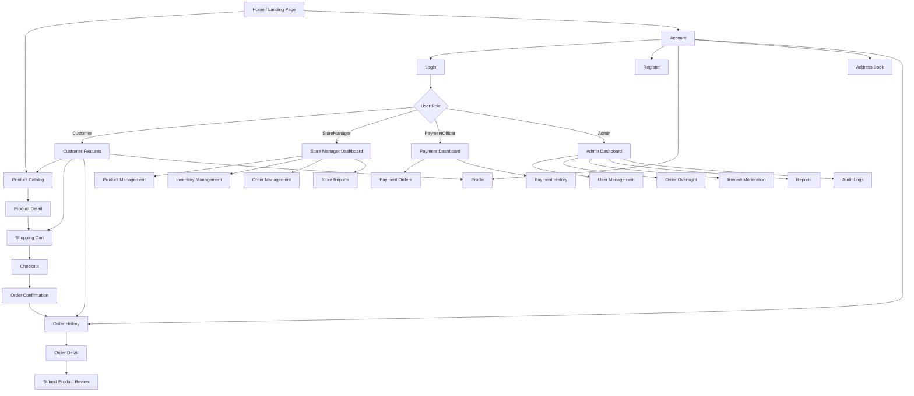

# 11. UI/UX Design & Frontend Specifications

## 11.1 Design Principles

The Ruqi Store interface follows core usability heuristics and responsive e-commerce design principles to provide a clear, accessible, and consistent furniture shopping experience.

| Principle                       | Application in Ruqi Store                                                                                                                                                            |
| ------------------------------- | ------------------------------------------------------------------------------------------------------------------------------------------------------------------------------------ |
| **Consistency**                 | Standardized navigation, page layouts, product cards, forms, buttons, status badges, and spacing across all views.                                                                   |
| **Visibility of System Status** | Cart item counts, active navigation indicators, product stock status, order fulfillment status, and payment status are clearly displayed to users.                                   |
| **Feedback**                    | User actions provide clear success and error feedback through toast notifications, inline validation messages, loading states, and updated order or cart information.                |
| **Error Prevention & Recovery** | Forms use inline validation, stock quantities are validated before cart updates and checkout, invalid order status transitions are blocked, and payment rejection requires a reason. |
| **Accessibility (WCAG 2.1 AA)** | The interface maintains sufficient color contrast, visible keyboard focus states, semantic HTML elements, descriptive labels, and accessible interactive controls.                   |
| **Responsive Design**           | Layouts adapt to mobile, tablet, and desktop screen sizes while maintaining usability across all major customer and management pages.                                                |
| **RTL / LTR Support**           | The interface supports both Arabic RTL and English LTR layouts using logical CSS properties and culture-based language switching.                                                    |

---

## 11.2 Navigation Structure



---

## 11.3 Page Layouts & Wireframes

### A. Product Catalog Page (RTL View Example)

```text
┌─────────────────────────────────────────────────────────────┐
│ [Ruqi Logo]   [البحث عن أثاث...]      [العربية/EN] [🛒 السلة (2)] │
│ الرئيسية | المنتجات | الحساب                         [تسجيل الدخول] │
├─────────────────────────────────────────────────────────────┤
│ الرئيسية > المنتجات                                         │
│                                                             │
│ المنتجات                                                    │
│                                                             │
├─────────────┬───────────────────────────────────────────────┤
│ تصفية حسب   │ المنتجات                                      │
│             │                                               │
│ التصنيف     │ ┌──────────────────────┐ ┌──────────────────┐ │
│ [ الكل ]    │ │     [صورة المنتج]     │ │  [صورة المنتج]  │ │
│ [ غرفة المعيشة ] │ │                  │ │                  │ │
│ [ غرفة النوم ]   │ │ كرسي مريح        │ │ طاولة خشبية     │ │
│ [ غرفة الطعام ]  │ │ 625.00 ₪         │ │ 1,250.00 ₪      │ │
│             │ │ [🛒 أضف للسلة]       │ │ [🛒 أضف للسلة]  │ │
│ السعر       │ │ داخل المخزون         │ │ داخل المخزون     │ │
│ [من] [إلى] │ └──────────────────────┘ └──────────────────┘ │
│             │                                               │
│ المادة      │ ┌──────────────────────┐ ┌──────────────────┐ │
│ [ خشب ]     │ │     [صورة المنتج]     │ │  [صورة المنتج]  │ │
│ [ معدن ]    │ │                      │ │                  │ │
│             │ │ أريكة فاخرة          │ │ وحدة ديكور       │ │
│ التوفر      │ │ 3,400.00 ₪          │ │ 450.00 ₪         │ │
│ [✓ متوفر]   │ │ [🛒 أضف للسلة]       │ │ [🛒 أضف للسلة]  │ │
│             │ └──────────────────────┘ └──────────────────┘ │
├─────────────┴───────────────────────────────────────────────┤
│ © 2026 Ruqi Store. جميع الحقوق محفوظة.                      │
└─────────────────────────────────────────────────────────────┘
```

> **Note:** The catalog displays only active products belonging to active categories. Pagination is used to keep the product listing manageable.

---

### B. Product Detail Page (RTL View Example)

```text
┌─────────────────────────────────────────────────────────────┐
│ [Ruqi Logo]   [البحث عن أثاث...]      [العربية/EN] [🛒 السلة] │
│ الرئيسية | المنتجات | الحساب                               │
├─────────────────────────────────────────────────────────────┤
│ الرئيسية > المنتجات > تفاصيل المنتج                         │
│                                                             │
│ ┌───────────────────────┐   كرسي مكتب مريح                  │
│ │                       │   SKU: CHR-001                    │
│ │    [صورة المنتج]      │                                   │
│ │                       │   السعر: 625.00 ₪                 │
│ └───────────────────────┘                                   │
│ [صورة] [صورة] [صورة]      الحالة: متوفر                    │
│                                                             │
│                              المادة: خشب                    │
│                              الأبعاد: 60 × 55 × 90 cm       │
│                              الوزن: 12 kg                    │
│                                                             │
│                              الكمية: [ − ] [ 1 ] [ + ]     │
│                              [ 🛒 أضف إلى السلة ]            │
│                                                             │
├─────────────────────────────────────────────────────────────┤
│ التقييم: ★★★★☆ 4.2                                        │
│                                                             │
│ مراجعات العملاء                                             │
│ ┌─────────────────────────────────────────────────────────┐ │
│ │ ★★★★★  منتج ممتاز                                       │ │
│ │ مراجعة من عميل موثّق                                    │ │
│ └─────────────────────────────────────────────────────────┘ │
├─────────────────────────────────────────────────────────────┤
│ © 2026 Ruqi Store. جميع الحقوق محفوظة.                      │
└─────────────────────────────────────────────────────────────┘
```

---

### C. Shopping Cart Page (RTL View Example)

```text
┌─────────────────────────────────────────────────────────────┐
│ [Ruqi Logo]      [العربية/EN]                 [🛒 السلة]    │
├─────────────────────────────────────────────────────────────┤
│ الرئيسية > السلة                                            │
│                                                             │
│ سلة التسوق                                                   │
│                                                             │
│ ┌─────────────────────────────────────────────────────────┐ │
│ │ [صورة] │ كرسي مريح │ 625 ₪ │ [ − ] 2 [ + ] │ 1,250 ₪ │ │
│ │        │           │       │               │ [حذف]     │ │
│ └─────────────────────────────────────────────────────────┘ │
│                                                             │
│ ┌─────────────────────────────────────────────────────────┐ │
│ │ الإجمالي الفرعي:                         1,250 ₪        │ │
│ │ الضريبة:                                   50 ₪         │ │
│ │ الشحن:                                     20 ₪         │ │
│ │ الإجمالي:                               1,320 ₪         │ │
│ └─────────────────────────────────────────────────────────┘ │
│                                                             │
│                         [ المتابعة إلى الدفع ]              │
├─────────────────────────────────────────────────────────────┤
│ © 2026 Ruqi Store. جميع الحقوق محفوظة.                      │
└─────────────────────────────────────────────────────────────┘
```

---

### D. Checkout Page (LTR View Example)

```text
┌─────────────────────────────────────────────────────────────┐
│ [Ruqi Logo]       [AR / English]                 [Cart]     │
├─────────────────────────────────────────────────────────────┤
│ Home > Checkout                                             │
│                                                             │
│ CHECKOUT                                                    │
│                                                             │
│ 1. DELIVERY ADDRESS                                         │
│                                                             │
│ [ Home Address ]                                            │
│ Full Name: Customer Name                                    │
│ Address: Main Street, City                                  │
│ Phone: +970 XXX XXX XXX                                     │
│                                                             │
│ [ + Add New Address ]                                       │
│                                                             │
│ 2. PAYMENT METHOD                                           │
│                                                             │
│ ( ) Cash on Delivery                                        │
│ ( ) Bank Transfer                                           │
│                                                             │
│ 3. ORDER SUMMARY                                            │
│ Items Total:                         1,250 ₪                │
│ Shipping:                               20 ₪                │
│ Tax:                                    50 ₪                │
│ Total:                               1,320 ₪                │
│                                                             │
│                 [ Confirm Order ]                            │
├─────────────────────────────────────────────────────────────┤
│ © 2026 Ruqi Store. All Rights Reserved.                     │
└─────────────────────────────────────────────────────────────┘
```

> **Note:** Order placement is processed through an atomic EF Core transaction. If any validation or stock operation fails, the transaction is rolled back.

---

### E. Store Manager Dashboard

```text
┌─────────────────────────────────────────────────────────────┐
│ Ruqi Store                         Store Manager | Logout     │
├───────────────┬─────────────────────────────────────────────┤
│ Dashboard     │ STORE MANAGER DASHBOARD                     │
│ Products      │                                             │
│ Categories    │ ┌────────────┐ ┌────────────┐              │
│ Inventory     │ │ Revenue    │ │ Products   │              │
│ Orders        │ │ 25,400 ₪   │ │ 128 Active │              │
│ Reports       │ └────────────┘ └────────────┘              │
│               │                                             │
│               │ ┌────────────┐ ┌────────────┐              │
│               │ │ Low Stock  │ │ Pending    │              │
│               │ │ 8 Products │ │ 12 Orders  │              │
│               │ └────────────┘ └────────────┘              │
│               │                                             │
│               │ Revenue Overview                            │
│               │ ┌─────────────────────────────────────────┐ │
│               │ │              [BAR CHART]                │ │
│               │ └─────────────────────────────────────────┘ │
│               │                                             │
│               │ Top Products / Inventory Summary            │
├───────────────┴─────────────────────────────────────────────┤
│ © 2026 Ruqi Store. All Rights Reserved.                     │
└─────────────────────────────────────────────────────────────┘
```

---

### F. Admin Dashboard

```text
┌─────────────────────────────────────────────────────────────┐
│ Ruqi Store                              Administrator        │
├───────────────┬─────────────────────────────────────────────┤
│ Dashboard     │ ADMIN CONTROL PANEL                         │
│ Users         │                                             │
│ Orders        │ ┌────────────┐ ┌────────────┐              │
│ Reviews       │ │ Users      │ │ Orders     │              │
│ Reports       │ │ 1,250      │ │ 540        │              │
│ Audit Logs    │ └────────────┘ └────────────┘              │
│               │                                             │
│               │ ┌────────────┐ ┌────────────┐              │
│               │ │ Reviews    │ │ Revenue    │              │
│               │ │ 15 Pending │ │ 85,400 ₪   │              │
│               │ └────────────┘ └────────────┘              │
│               │                                             │
│               │ Recent Audit Events                         │
│               │ ┌─────────────────────────────────────────┐ │
│               │ │ Timestamp | Action | Target | Admin     │ │
│               │ │ ...       | ...    | ...    | ...       │ │
│               │ └─────────────────────────────────────────┘ │
├───────────────┴─────────────────────────────────────────────┤
│ © 2026 Ruqi Store. All Rights Reserved.                     │
└─────────────────────────────────────────────────────────────┘
```

---

## 11.4 Accessibility Considerations

To ensure an inclusive and responsive interface, the following accessibility requirements are applied throughout Ruqi Store:

| Requirement                          | Implementation Details                                                                                                                                                                               |
| ------------------------------------ | ---------------------------------------------------------------------------------------------------------------------------------------------------------------------------------------------------- |
| **Color Contrast**                   | Text, labels, buttons, status indicators, and form elements maintain a minimum contrast ratio of 4.5:1 against their backgrounds.                                                                    |
| **Color Independence**               | Status information is never communicated through color alone. Fulfillment and payment statuses include readable text such as `Pending`, `Processing`, `Shipped`, `Delivered`, `Paid`, or `Rejected`. |
| **Keyboard Navigation**              | All interactive elements are accessible through keyboard navigation using standard `Tab`, `Shift+Tab`, `Enter`, and `Spacebar` interactions.                                                         |
| **RTL / LTR Bi-directional Support** | Arabic uses RTL layout while English uses LTR layout. CSS logical properties such as `margin-inline-start` and `padding-inline-end` are used so layouts mirror correctly.                            |
| **Screen Readers (ARIA)**            | Interactive icons, image galleries, navigation controls, form inputs, and icon-only buttons use descriptive labels and appropriate ARIA attributes.                                                  |
| **Form Accessibility**               | Validation messages are displayed near the relevant input fields and provide clear instructions for correcting invalid values.                                                                       |
| **Responsive Accessibility**         | Pages remain usable from 320px mobile screens through large desktop displays without losing essential functionality.                                                                                 |
| **Focus Visibility**                 | Keyboard focus indicators remain clearly visible on buttons, links, form controls, navigation items, and other interactive elements.                                                                 |

---

## 11.5 Responsive Design

| Breakpoint  | Width          | Layout                                                                                                                 |
| ----------- | -------------- | ---------------------------------------------------------------------------------------------------------------------- |
| **Mobile**  | 320px – 767px  | Single-column layouts, collapsible navigation, stacked forms, and horizontally scrollable data tables where necessary. |
| **Tablet**  | 768px – 1023px | Two-column product grids, adaptive dashboards, and optimized navigation.                                               |
| **Desktop** | 1024px+        | Three- or four-column product grids, full navigation, sidebars for management dashboards, and wider data tables.       |

### Responsive Behavior

* Product cards automatically adapt to the available screen width.
* Checkout sections stack vertically on smaller screens.
* Management tables support horizontal scrolling on mobile devices.
* Navigation collapses into a mobile-friendly menu on smaller screens.
* Forms use responsive widths while maintaining readable labels and input controls.
* Dashboard cards rearrange automatically according to available screen space.

---

## 11.6 Localization & RTL/LTR Support

Ruqi Store supports both **English** and **Arabic** interfaces.

### Language Configuration

* **English HTML tag:** `<html lang="en" dir="ltr">`
* **Arabic HTML tag:** `<html lang="ar" dir="rtl">`
* **CSS:** Logical properties such as `margin-inline-start`, `margin-inline-end`, `padding-inline-start`, and `padding-inline-end` are used instead of directional properties such as `margin-left` or `margin-right`.
* **Language Toggle:** The selected language is stored using the `.AspNetCore.Culture` cookie.
* **Language Controller:** `LanguageController.cs` handles language switching and updates the culture cookie.
* **Layouts:** Razor layouts adapt according to the selected culture and text direction.

### Price Display Rule

In RTL Arabic mode:

* Currency symbol appears according to the configured Arabic price format.
* Text flows from right to left.
* Price values remain left-to-right where necessary using `dir="ltr"` on numeric price elements.

Example:

```html
<span dir="ltr">1,200 ₪</span>
```

---

## 11.7 UI Component Standards

The following design system rules ensure visual consistency throughout Ruqi Store:

| Component               | Specification                                                                                                           |
| ----------------------- | ----------------------------------------------------------------------------------------------------------------------- |
| **Primary Button**      | Deep navy blue (`#1A2B4C`), white text, minimum height of 48px, clear hover and focus states.                           |
| **Secondary Button**    | Transparent or neutral background with a solid 1px border, dark text, and a visible focus state.                        |
| **Form Inputs**         | Light background, clear 1px border, readable placeholder text, associated labels, and visible focus indication.         |
| **Product Cards**       | Clean white background, structured product information, product image, price, stock status, and primary cart action.    |
| **Status Badges**       | Clear text labels for fulfillment and payment states, with color used only as a supporting visual indicator.            |
| **Toast Notifications** | Displayed in a consistent top-end position and automatically dismissed after a short period while remaining accessible. |
| **Loading States**      | Buttons display a loading state after submission to prevent duplicate actions.                                          |
| **Validation Messages** | Displayed inline next to the relevant form field using clear, user-friendly language.                                   |
| **Image Gallery**       | Main product image with thumbnail navigation and accessible labels for product images.                                  |
| **Data Tables**         | Consistent column headers, pagination, filtering controls, and horizontal scrolling on smaller screens.                 |

---

## 11.8 Frontend Technology & Implementation

| Technology                    | Usage                                                                                                        |
| ----------------------------- | ------------------------------------------------------------------------------------------------------------ |
| **Razor Views (`.cshtml`)**   | Server-rendered user interface for customer and management pages.                                            |
| **HTML5**                     | Semantic page structure and accessible form elements.                                                        |
| **CSS3**                      | Responsive layouts, RTL/LTR support, component styling, and visual consistency.                              |
| **Vanilla JavaScript**        | Client-side interactions, UI feedback, quantity controls, image gallery interactions, and form enhancements. |
| **ASP.NET Core MVC**          | Controller-driven page navigation and server-side request handling.                                          |
| **Razor Validation**          | Display of model validation and business-rule validation messages within forms.                              |
| **ASP.NET Core Localization** | English and Arabic culture support through the application culture configuration.                            |

---

## 11.9 Page Inventory

The final Ruqi Store interface contains the following main pages:

### Public Pages

| Page                | Route                   |
| ------------------- | ----------------------- |
| **Home / Landing**  | `/`                     |
| **Product Catalog** | `/Products`             |
| **Product Detail**  | `/Products/Detail/{id}` |
| **Register**        | `/Account/Register`     |
| **Login**           | `/Account/Login`        |

### Customer Pages

| Page                   | Route                       |
| ---------------------- | --------------------------- |
| **Shopping Cart**      | `/Cart`                     |
| **Checkout**           | `/Orders/Checkout`          |
| **Order Confirmation** | `/Orders/Confirmation/{id}` |
| **Order History**      | `/Orders/History`           |
| **Order Detail**       | `/Orders/Detail/{id}`       |
| **Address Book**       | `/Account/AddressBook`      |
| **Profile**            | `/Account/Profile`          |

### Payment Officer Pages

| Page                     | Route                       |
| ------------------------ | --------------------------- |
| **Payment Dashboard**    | `/Payment/Dashboard`        |
| **Payment Order Detail** | `/Payment/OrderDetail/{id}` |
| **Payment History**      | `/Payment/History`          |

### Store Manager Pages

| Page                   | Route                |
| ---------------------- | -------------------- |
| **Manager Dashboard**  | `/Manager/Dashboard` |
| **Product Management** | `/Manager/Products`  |
| **Order Management**   | `/Manager/Orders`    |

### Admin Pages

| Page                | Route             |
| ------------------- | ----------------- |
| **Admin Dashboard** | `/Admin`          |
| **User Management** | `/Admin/Users`    |
| **Audit Log**       | `/Admin/AuditLog` |

---

## 11.10 Interaction Patterns

| Interaction              | Frontend Behavior                                                                                                                       |
| ------------------------ | --------------------------------------------------------------------------------------------------------------------------------------- |
| **Form Validation**      | Validation errors appear inline beside the relevant field instead of exposing raw exceptions.                                           |
| **Submit Buttons**       | Buttons enter a loading/disabled state after the first submission to prevent duplicate requests.                                        |
| **Toast Notifications**  | Successful and failed operations provide short user-facing notifications.                                                               |
| **Cart Quantity**        | Quantity controls provide immediate validation against the available `StockQuantity`.                                                   |
| **Order Status**         | Fulfillment and payment statuses are displayed using readable status badges and clear labels.                                           |
| **Image Interaction**    | Product galleries allow users to select thumbnails and view the selected product image.                                                 |
| **Pagination**           | Product and management lists use pagination to keep large datasets manageable.                                                          |
| **Filtering**            | Catalog and management pages provide appropriate filters for categories, price, availability, status, and other supported criteria.     |
| **Confirmation Dialogs** | Destructive or important administrative actions such as user deactivation and review moderation require confirmation before submission. |

---

[← Previous: Detailed Class Design](./10-detailed-design.md) | [Back to Index](./00-index.md) | [Next: Traceability Matrix](./12-traceability.md)]
