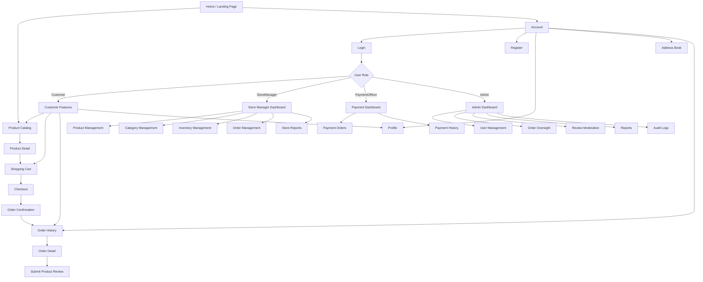

# 11 — UI/UX Design & Frontend Specifications

## Ruqi Store — ASP.NET Core MVC

---

## 11.1 Design Principles

The Ruqi Store interface follows core usability heuristics and responsive e-commerce design principles to provide a clear, accessible, and consistent furniture shopping experience.

| Principle                       | Application in Ruqi Store                                                                                                                               |
| ------------------------------- | ------------------------------------------------------------------------------------------------------------------------------------------------------- |
| **Consistency**                 | Standardized navigation, page layouts, product cards, forms, buttons, status badges, and spacing across customer and management pages.                  |
| **Visibility of System Status** | Cart quantities, product stock status, fulfillment status, and payment status are clearly displayed.                                                    |
| **Feedback**                    | User actions provide clear success and error feedback through inline validation, loading states, and updated cart or order information.                 |
| **Error Prevention & Recovery** | Stock quantities are validated before cart updates and checkout, invalid order status transitions are blocked, and payment rejection requires a reason. |
| **Accessibility (WCAG 2.1 AA)** | Interactive elements provide keyboard accessibility, visible focus states, descriptive labels, and sufficient color contrast.                           |
| **Responsive Design**           | Layouts adapt to mobile, tablet, and desktop screen sizes.                                                                                              |
| **RTL / LTR Support**           | The interface supports Arabic RTL and English LTR layouts using CSS logical properties and ASP.NET Core localization.                                   |

---

## 11.2 Navigation Structure



---

## 11.3 Page Layouts & Wireframes

### A. Product Catalog Page

```text
┌─────────────────────────────────────────────────────────────┐
│ [Ruqi Logo]   [Search Furniture...]   [AR / EN] [Cart (2)] │
│ Home | Products | Account                         [Login]   │
├─────────────────────────────────────────────────────────────┤
│ Home > Products                                              │
│                                                             │
│ PRODUCTS                                                    │
│                                                             │
├─────────────┬───────────────────────────────────────────────┤
│ FILTERS     │ PRODUCTS                                      │
│             │                                               │
│ Category    │ ┌──────────────────────┐ ┌──────────────────┐ │
│ [ All ]     │ │   [Product Image]    │ │ [Product Image]  │ │
│ [Living]    │ │                      │ │                  │ │
│ [Bedroom]   │ │ Comfortable Chair    │ │ Wooden Table     │ │
│ [Dining]    │ │ 625.00 ₪             │ │ 1,250.00 ₪       │ │
│             │ │ [Add to Cart]        │ │ [Add to Cart]    │ │
│ Price       │ │ In Stock             │ │ In Stock          │ │
│ [Min] [Max] │ └──────────────────────┘ └──────────────────┘ │
│             │                                               │
│ Material    │ ┌──────────────────────┐ ┌──────────────────┐ │
│ [Wood]      │ │   [Product Image]    │ │ [Product Image]  │ │
│ [Metal]     │ │                      │ │                  │ │
│             │ │ Luxury Sofa          │ │ Decor Unit       │ │
│ Availability│ │ 3,400.00 ₪           │ │ 450.00 ₪         │ │
│ [✓ In Stock]│ │ [Add to Cart]        │ │ In Stock          │ │
│             │ └──────────────────────┘ └──────────────────┘ │
├─────────────┴───────────────────────────────────────────────┤
│ © 2026 Ruqi Store. All Rights Reserved.                     │
└─────────────────────────────────────────────────────────────┘
```

The catalog displays only active products belonging to active categories. Products are paginated with 20 products per page and sorted by newest first.

Supported filters include:

* Category
* Price range
* Material
* Availability
* Keyword search

---

### B. Product Detail Page

```text
┌─────────────────────────────────────────────────────────────┐
│ [Ruqi Logo]   [Search Furniture...]   [AR / EN] [Cart]      │
│ Home | Products | Account                                    │
├─────────────────────────────────────────────────────────────┤
│ Home > Products > Product Detail                             │
│                                                             │
│ ┌───────────────────────┐   Comfortable Office Chair        │
│ │                       │   SKU: CHR-001                    │
│ │    [Product Image]    │                                   │
│ │                       │   Price: 625.00 ₪                 │
│ └───────────────────────┘                                   │
│ [Image] [Image] [Image]      Status: In Stock              │
│                                                             │
│                              Material: Wood                  │
│                              Dimensions: 60 × 55 × 90 cm    │
│                              Weight: 12 kg                   │
│                                                             │
│                              Quantity: [ − ] [ 1 ] [ + ]    │
│                              [ Add to Cart ]                 │
│                                                             │
├─────────────────────────────────────────────────────────────┤
│ Rating: ★★★★☆ 4.2                                           │
│                                                             │
│ Customer Reviews                                             │
│ ┌─────────────────────────────────────────────────────────┐ │
│ │ ★★★★★  Excellent Product                                │ │
│ │ Verified Purchase                                        │ │
│ └─────────────────────────────────────────────────────────┘ │
├─────────────────────────────────────────────────────────────┤
│ © 2026 Ruqi Store. All Rights Reserved.                     │
└─────────────────────────────────────────────────────────────┘
```

The product detail page displays:

* Product image gallery
* Product name
* SKU
* Category
* Price
* Stock status
* Material
* Dimensions
* Weight
* Average rating
* Visible verified-purchase reviews
* Quantity selector
* Add to Cart action

The quantity selector cannot exceed the available `StockQuantity`.

---

### C. Shopping Cart Page

```text
┌─────────────────────────────────────────────────────────────┐
│ [Ruqi Logo]             [AR / EN]              [Cart]        │
├─────────────────────────────────────────────────────────────┤
│ Home > Cart                                                  │
│                                                             │
│ SHOPPING CART                                                │
│                                                             │
│ ┌─────────────────────────────────────────────────────────┐ │
│ │ [Image] │ Product │ 625 ₪ │ [ − ] 2 [ + ] │ 1,250 ₪   │ │
│ │         │         │       │               │ [Remove]    │ │
│ └─────────────────────────────────────────────────────────┘ │
│                                                             │
│ ┌─────────────────────────────────────────────────────────┐ │
│ │ Items Total:                             1,250 ₪        │ │
│ │ Tax:                                        50 ₪        │ │
│ │ Shipping:                                  20 ₪        │ │
│ │ Total:                                   1,320 ₪        │ │
│ └─────────────────────────────────────────────────────────┘ │
│                                                             │
│                    [ Proceed to Checkout ]                  │
├─────────────────────────────────────────────────────────────┤
│ © 2026 Ruqi Store. All Rights Reserved.                     │
└─────────────────────────────────────────────────────────────┘
```

Cart interactions include:

* View cart items
* Increase/decrease quantity
* Remove an item
* Validate quantity against current stock
* Display item subtotal
* Display total including tax and shipping
* Proceed to checkout

---

### D. Checkout Page

```text
┌─────────────────────────────────────────────────────────────┐
│ [Ruqi Logo]       [AR / English]                 [Cart]     │
├─────────────────────────────────────────────────────────────┤
│ Home > Checkout                                             │
│                                                             │
│ CHECKOUT                                                    │
│                                                             │
│ 1. DELIVERY ADDRESS                                         │
│                                                             │
│ [ Home Address ]                                            │
│ Full Name: Customer Name                                    │
│ Address: Main Street, City                                  │
│ Phone: +970 XXX XXX XXX                                     │
│                                                             │
│ [ + Add New Address ]                                       │
│                                                             │
│ 2. PAYMENT METHOD                                           │
│                                                             │
│ ( ) Cash on Delivery                                        │
│ ( ) Bank Transfer                                           │
│                                                             │
│ 3. ORDER SUMMARY                                            │
│ Items Total:                         1,250 ₪                │
│ Shipping:                               20 ₪                │
│ Tax:                                    50 ₪                │
│ Total:                               1,320 ₪                │
│                                                             │
│                 [ Confirm Order ]                            │
├─────────────────────────────────────────────────────────────┤
│ © 2026 Ruqi Store. All Rights Reserved.                     │
└─────────────────────────────────────────────────────────────┘
```

Checkout consists of:

1. Selecting or entering a delivery address.
2. Selecting Cash on Delivery or Bank Transfer.
3. Reviewing the order summary.
4. Confirming the order.
5. Displaying the order confirmation and `OrderId`.

Order placement is processed through an atomic EF Core transaction. If validation or stock processing fails, the transaction is rolled back and the customer's cart is preserved.

---

### E. Customer Order History

```text
┌─────────────────────────────────────────────────────────────┐
│ Ruqi Store                                      Customer     │
├─────────────────────────────────────────────────────────────┤
│ Home > Orders                                               │
│                                                             │
│ MY ORDERS                                                   │
│                                                             │
│ ┌───────┬────────────┬────────────┬──────────┬────────────┐ │
│ │ Order │ Date       │ Fulfillment│ Payment  │ Total      │ │
│ ├───────┼────────────┼────────────┼──────────┼────────────┤ │
│ │ #1024 │ 15 Aug     │ Processing │ Paid     │ 1,320 ₪    │ │
│ │ #1023 │ 10 Aug     │ Delivered  │ Paid     │ 850 ₪      │ │
│ └───────┴────────────┴────────────┴──────────┴────────────┘ │
│                                                             │
│                       [ View Details ]                       │
└─────────────────────────────────────────────────────────────┘
```

Order history displays:

* Order ID
* Date
* Fulfillment status
* Payment status
* Total amount
* View Details action

The order detail page provides the fulfillment timeline, payment information, items, delivery address, and total breakdown.

---

### F. Store Manager Dashboard

```text
┌─────────────────────────────────────────────────────────────┐
│ Ruqi Store                         Store Manager | Logout     │
├───────────────┬─────────────────────────────────────────────┤
│ Dashboard     │ STORE MANAGER DASHBOARD                     │
│ Products      │                                             │
│ Categories    │ ┌────────────┐ ┌────────────┐              │
│ Inventory     │ │ Revenue    │ │ Products   │              │
│ Orders        │ │ Daily /    │ │ Active     │              │
│ Reports       │ │ Weekly     │ │ Products   │              │
│               │ │ Monthly    │ │            │              │
│               │ └────────────┘ └────────────┘              │
│               │                                             │
│               │ ┌────────────┐ ┌────────────┐              │
│               │ │ Low Stock  │ │ Pending    │              │
│               │ │ Products   │ │ Orders     │              │
│               │ └────────────┘ └────────────┘              │
│               │                                             │
│               │ Revenue Overview                            │
│               │ ┌─────────────────────────────────────────┐ │
│               │ │              [BAR CHART]                │ │
│               │ └─────────────────────────────────────────┘ │
│               │                                             │
│               │ Top Products / Inventory Summary            │
├───────────────┴─────────────────────────────────────────────┤
│ © 2026 Ruqi Store. All Rights Reserved.                     │
└─────────────────────────────────────────────────────────────┘
```

The Store Manager dashboard provides:

* Total revenue by period
* Active product count
* Low-stock alerts
* Pending order count
* Revenue overview
* Top products
* Inventory summary

The manager can also access product management, categories, inventory, orders, and store reports.

---

### G. Payment Officer Dashboard

```text
┌─────────────────────────────────────────────────────────────┐
│ Ruqi Store                          Payment Officer | Logout │
├───────────────┬─────────────────────────────────────────────┤
│ Dashboard     │ PAYMENT DASHBOARD                           │
│ Orders        │                                             │
│ Payment Log   │ Unpaid Orders                               │
│               │ ┌─────────────────────────────────────────┐ │
│               │ │ Order | Customer | Method | Total | ... │ │
│               │ ├─────────────────────────────────────────┤ │
│               │ │ #1024 | Customer | Bank   | 1,320 ₪    │ │
│               │ └─────────────────────────────────────────┘ │
│               │                                             │
│               │ [ Mark Paid ]   [ Reject Payment ]          │
│               │                                             │
│               │ Payment History                             │
└───────────────┴─────────────────────────────────────────────┘
```

The Payment Officer manages payment status independently from fulfillment status.

Available payment methods are:

* Cash on Delivery
* Bank Transfer

Payment rejection requires a non-empty rejection reason, and every payment decision is recorded in the append-only `PaymentLogs` table.

---

### H. Admin Dashboard

```text
┌─────────────────────────────────────────────────────────────┐
│ Ruqi Store                              Administrator        │
├───────────────┬─────────────────────────────────────────────┤
│ Dashboard     │ ADMIN CONTROL PANEL                         │
│ Users         │                                             │
│ Orders        │ ┌────────────┐ ┌────────────┐              │
│ Reviews       │ │ Users      │ │ Orders     │              │
│ Reports       │ │ Total      │ │ Total      │              │
│ Audit Logs    │ └────────────┘ └────────────┘              │
│               │                                             │
│               │ ┌────────────┐ ┌────────────┐              │
│               │ │ Reviews    │ │ Revenue    │              │
│               │ │ Pending    │ │ Total      │              │
│               │ └────────────┘ └────────────┘              │
│               │                                             │
│               │ Recent Audit Events                         │
│               │ ┌─────────────────────────────────────────┐ │
│               │ │ Timestamp | Action | Target | Admin     │ │
│               │ │ ...       | ...    | ...    | ...       │ │
│               │ └─────────────────────────────────────────┘ │
├───────────────┴─────────────────────────────────────────────┤
│ © 2026 Ruqi Store. All Rights Reserved.                     │
└─────────────────────────────────────────────────────────────┘
```

The Admin panel provides:

* User management
* Role assignment and revocation
* Platform-wide order oversight
* Review moderation
* CSV reports
* Audit log access

Administrative actions such as account activation/deactivation, role changes, and review moderation require confirmation and are recorded in the append-only `AuditLogs` table.

---

## 11.4 Accessibility Considerations

| Requirement                  | Implementation Details                                                                                                            |
| ---------------------------- | --------------------------------------------------------------------------------------------------------------------------------- |
| **Color Contrast**           | Text, labels, buttons, status indicators, and form elements maintain sufficient contrast against their backgrounds.               |
| **Color Independence**       | Fulfillment and payment states are displayed using readable status labels rather than relying on color alone.                     |
| **Keyboard Navigation**      | Interactive elements are accessible using standard keyboard navigation.                                                           |
| **RTL / LTR Support**        | Arabic uses RTL layout while English uses LTR layout. CSS logical properties are used to allow layouts to mirror correctly.       |
| **Screen Readers (ARIA)**    | Image galleries, navigation controls, form inputs, and icon-only controls use descriptive labels and appropriate ARIA attributes. |
| **Form Accessibility**       | Validation messages appear near the relevant input fields and explain how to correct invalid values.                              |
| **Responsive Accessibility** | Pages remain usable across mobile, tablet, and desktop screen sizes.                                                              |
| **Focus Visibility**         | Keyboard focus indicators remain visible on interactive elements.                                                                 |

---

## 11.5 Responsive Design

| Breakpoint  | Width          | Layout                                                                                                            |
| ----------- | -------------- | ----------------------------------------------------------------------------------------------------------------- |
| **Mobile**  | 320px – 767px  | Single-column layouts, collapsible navigation, stacked forms, and horizontally scrollable tables where necessary. |
| **Tablet**  | 768px – 1023px | Two-column product grids, adaptive dashboards, and optimized navigation.                                          |
| **Desktop** | 1024px+        | Three- or four-column product grids, full navigation, management sidebars, and wider data tables.                 |

### Responsive Behavior

* Product cards adapt to the available screen width.
* Checkout sections stack vertically on smaller screens.
* Management tables support horizontal scrolling on mobile devices.
* Navigation collapses into a mobile-friendly menu on smaller screens.
* Forms use responsive widths while maintaining readable labels and controls.
* Dashboard cards rearrange according to the available screen space.

---

## 11.6 Localization & RTL/LTR Support

Ruqi Store supports both **English** and **Arabic** interfaces.

### Language Configuration

* **English HTML tag:** `<html lang="en" dir="ltr">`
* **Arabic HTML tag:** `<html lang="ar" dir="rtl">`
* **CSS:** Logical properties such as `margin-inline-start`, `margin-inline-end`, `padding-inline-start`, and `padding-inline-end` are used instead of directional properties such as `margin-left` or `margin-right`.
* **Language Toggle:** The selected language is stored using the `.AspNetCore.Culture` cookie.
* **Language Controller:** `LanguageController.cs` handles language switching and updates the culture cookie.
* **Layouts:** Razor layouts adapt according to the selected culture and text direction.

### Price Display Rule

In RTL Arabic mode:

* Text flows from right to left.
* Currency formatting follows the configured Arabic price format.
* Numeric price values remain left-to-right where necessary using `dir="ltr"`.

Example:

```html
<span dir="ltr">1,200 ₪</span>
```

---

## 11.7 UI Component Standards

| Component               | Specification                                                                                         |
| ----------------------- | ----------------------------------------------------------------------------------------------------- |
| **Primary Button**      | Clear primary action with visible hover and focus states and a minimum comfortable touch height.      |
| **Secondary Button**    | Neutral or transparent background with a visible border and focus state.                              |
| **Form Inputs**         | Clear labels, readable placeholders, validation feedback, and visible focus indication.               |
| **Product Cards**       | Product image, name, price, stock status, and primary cart action.                                    |
| **Status Badges**       | Readable fulfillment and payment status labels with color used only as a supporting visual indicator. |
| **Toast Notifications** | Consistent success and failure notifications that are automatically dismissed after a short period.   |
| **Loading States**      | Buttons display a loading/disabled state after submission to prevent duplicate actions.               |
| **Validation Messages** | Displayed inline next to the relevant field using clear user-friendly language.                       |
| **Image Gallery**       | Main product image with thumbnail navigation and accessible labels.                                   |
| **Data Tables**         | Consistent headers, pagination, filtering, and horizontal scrolling on smaller screens.               |

---

## 11.8 Frontend Technology & Implementation

| Technology                    | Usage                                                                                                       |
| ----------------------------- | ----------------------------------------------------------------------------------------------------------- |
| **Razor Views (`.cshtml`)**   | Server-rendered user interface for customer and management pages.                                           |
| **HTML5**                     | Semantic page structure and accessible form elements.                                                       |
| **CSS3**                      | Responsive layouts, RTL/LTR support, component styling, and visual consistency.                             |
| **Vanilla JavaScript**        | Client-side interactions, quantity controls, image gallery behavior, loading states, and form enhancements. |
| **ASP.NET Core MVC**          | Controller-driven page navigation and server-side request handling.                                         |
| **Razor Validation**          | Display of model and validation errors within forms.                                                        |
| **ASP.NET Core Localization** | English and Arabic culture support through application culture configuration.                               |

The frontend is server-rendered through Razor Views and does not use a separate React or SPA frontend.

---

## 11.9 Page Inventory

The following pages represent the main customer and management interfaces defined for Ruqi Store.

### Public Pages

| Page                | Route                   |
| ------------------- | ----------------------- |
| **Home / Landing**  | `/`                     |
| **Product Catalog** | `/Products`             |
| **Product Detail**  | `/Products/Detail/{id}` |
| **Register**        | `/Account/Register`     |
| **Login**           | `/Account/Login`        |

### Customer Pages

| Page                   | Route                       |
| ---------------------- | --------------------------- |
| **Shopping Cart**      | `/Cart`                     |
| **Checkout**           | `/Orders/Checkout`          |
| **Order Confirmation** | `/Orders/Confirmation/{id}` |
| **Order History**      | `/Orders/History`           |
| **Order Detail**       | `/Orders/Detail/{id}`       |
| **Address Book**       | `/Account/AddressBook`      |
| **Profile**            | `/Account/Profile`          |

### Payment Officer Pages

| Page                     | Route                       |
| ------------------------ | --------------------------- |
| **Payment Dashboard**    | `/Payment/Dashboard`        |
| **Payment Order Detail** | `/Payment/OrderDetail/{id}` |
| **Payment History**      | `/Payment/History`          |

### Store Manager Pages

| Page                     | Route                 |
| ------------------------ | --------------------- |
| **Manager Dashboard**    | `/Manager/Dashboard`  |
| **Product Management**   | `/Manager/Products`   |
| **Category Management**  | `/Manager/Categories` |
| **Inventory Management** | `/Manager/Inventory`  |
| **Order Management**     | `/Manager/Orders`     |
| **Store Reports**        | `/Manager/Reports`    |

### Admin Pages

| Page                  | Route             |
| --------------------- | ----------------- |
| **Admin Dashboard**   | `/Admin`          |
| **User Management**   | `/Admin/Users`    |
| **Order Oversight**   | `/Admin/Orders`   |
| **Review Moderation** | `/Admin/Reviews`  |
| **Reports**           | `/Admin/Reports`  |
| **Audit Log**         | `/Admin/AuditLog` |

---

## 11.10 Interaction Patterns

| Interaction              | Frontend Behavior                                                                                                                       |
| ------------------------ | --------------------------------------------------------------------------------------------------------------------------------------- |
| **Form Validation**      | Validation errors appear inline beside the relevant field instead of exposing raw exceptions.                                           |
| **Submit Buttons**       | Buttons enter a loading/disabled state after the first submission to prevent duplicate requests.                                        |
| **Toast Notifications**  | Successful and failed operations provide short user-facing notifications.                                                               |
| **Cart Quantity**        | Quantity controls provide immediate validation against available `StockQuantity`.                                                       |
| **Order Status**         | Fulfillment and payment statuses are displayed using readable status badges and clear labels.                                           |
| **Image Interaction**    | Product galleries allow users to select thumbnails and view the selected product image.                                                 |
| **Pagination**           | Product and management lists use pagination to keep large datasets manageable.                                                          |
| **Filtering**            | Catalog and management pages provide filters for categories, price, availability, status, and supported search criteria.                |
| **Confirmation Dialogs** | Important administrative actions such as user deactivation, role changes, and review moderation require confirmation before submission. |
| **Data Isolation**       | Customer-facing pages display and operate only on the authenticated customer's own cart, orders, addresses, and reviews.                |

---

## 11.11 Security-Aware Frontend Requirements

The frontend works together with ASP.NET Core Identity and the Service Layer to protect application functionality.

| Requirement            | Implementation                                                                                                     |
| ---------------------- | ------------------------------------------------------------------------------------------------------------------ |
| **Authentication**     | Protected pages require an authenticated Identity user.                                                            |
| **Role Authorization** | Management pages use role-based authorization for `Customer`, `StoreManager`, `PaymentOfficer`, and `Admin`.       |
| **CSRF Protection**    | Protected POST forms use ASP.NET Core anti-forgery protection.                                                     |
| **Data Isolation**     | Customer data is validated against the authenticated user's ID in the Service Layer.                               |
| **Password Handling**  | Passwords are submitted to ASP.NET Core Identity and are never displayed or stored by the frontend.                |
| **Secure Cookies**     | Authentication uses secure, HttpOnly cookies managed by ASP.NET Core Identity.                                     |
| **Validation**         | Client-side feedback improves usability while authoritative business-rule validation remains in the Service Layer. |

---

## 11.12 Future UI Features

The following feature is planned but is **not available in the current version**:

### Wishlist

The Wishlist feature is planned as a future enhancement. When implemented, customers will be able to:

* Save favorite furniture products.
* View saved products.
* Move saved products to the shopping cart.

No current UI page or route is required for Wishlist in the current version of Ruqi Store.

---

[← Previous: Detailed Class Design](10-detailed-design.md) | [Back to Index](00-index.md) | [Next: Traceability Matrix](12-traceability.md)
